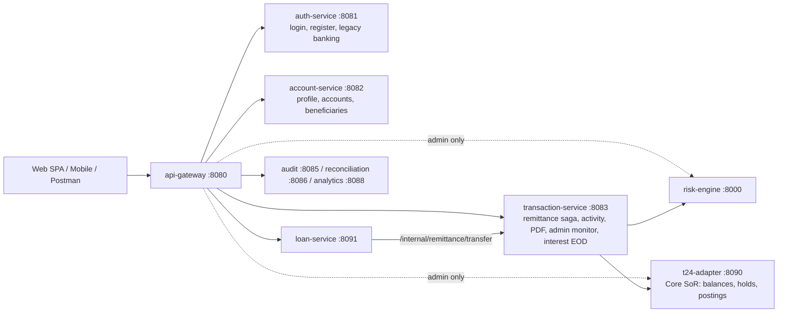

# PayPink 2.0 — API Reference (post T24/DDD refactor)

_Last updated: 08/10/2026 (Phases 0–10, Phase 10 DB-driven RBAC, automated 3-attempt bank loan retries & manual retry removal, centralized Swagger UI / OpenAPI 3.0 documentation, and platform-wide RFC-7807 problem details standardisation)_

This document lists every HTTP endpoint after the T24 Core / Domain-Driven Design refactor. For each one it shows what it does, who can call it, and how the API Gateway routes it. It ends with what changed since the previous review and the verified access-control and bug fixes.

---

## 1. Architecture at a glance

**t24-adapter is now the System of Record.** It owns live balances, holds (`t24.LOCKED_AMOUNT`) and the double-entry journal (`t24.POSTING_JOURNAL`). transaction-service orchestrates transfers: it scores risk, then places a T24 hold, then posts to T24 and settles.

### Gateway rules — [`JwtAuthFilter.java`](../microservices/api-gateway/src/main/java/com/bank/gateway/JwtAuthFilter.java), [`application.yml`](../microservices/api-gateway/src/main/resources/application.yml)

The gateway always strips client-sent `X-Auth-Username`, `X-Auth-Customer-Id`, `X-Auth-Roles` and `X-Internal-Service`. After verifying the JWT, it sets those headers itself from the token's claims.

| Rule | Paths |
|---|---|
| **Public (no JWT)** — checked first | `/api/v1/auth/login`, `/api/v1/auth/banking/login`, `/api/v1/auth/banking/register`, `/swagger-ui.html`, `/swagger-ui/**`, `/v3/api-docs/**`, `/webjars/**`, `/api/v1/risk/health\|docs\|openapi`, `/api/v1/t24/health`, `/api/v1/remittance/health`, `/actuator/**` |
| **Admin only (`ROLE_ADMIN`)** | `/api/v1/loans/eod/**`, `/api/v1/interest/eod/**`, `/api/v1/auth/admin/**`, `/api/v1/transactions/admin/**`, `/api/v1/stress/**`, `/api/v1/ledger/**`, `/api/v1/t24/**`, `/api/v1/risk/**`, plus `/api/v1/accounts/**/status` and `/api/v1/accounts/*/reset-balance` |
| **Any valid JWT** | Everything else |
| **Rate limited** (Redis token bucket, per user) | `/ledger`, `/stress`, `/remittance`, `/loans` |
| **Circuit breaker** | `/ledger` (falls back to `/fallback/transaction`, 503) |
| **Not routed (internal only)** | `/internal/**`, `/ofs/**`, `/api/v1/outbox/**` |

### Legacy path cutover (Phase 6 auth slimming)

The gateway rewrites these old auth-service URLs so existing clients (including the frozen mobile app) keep working:

| Client calls | Gateway forwards to |
|---|---|
| `/api/v1/auth/banking/recipients[/**]` | account-service `/api/v1/accounts/recipients[/**]` |
| `/api/v1/auth/banking/favorites[/**]` | account-service `/api/v1/accounts/favorites[/**]` |
| `/api/v1/auth/admin/transactions/today` | transaction-service `/api/v1/transactions/admin/today` |

**Auth legend:** 🌐 public · 🔑 any valid JWT · 👑 admin · 🔒 internal only (no gateway route)

---

## 2. auth-service (:8081) — identity

### Login and registration
| Method & path | Auth | What it does |
|---|---|---|
| `POST /api/v1/auth/login` | 🌐 | Takes `{username, password}` and returns a 24h JWT with `customerId` and `roles`. The `admin` account gets `ROLE_ADMIN` + `ROLE_CORE_ENGINEER`. ([`AuthController.java`](../microservices/auth-service/src/main/java/com/bank/auth/controller/AuthController.java)) |
| `POST /api/v1/auth/banking/register` | 🌐 | Customer self-registration. Returns 201 with a JWT, or 409 if the username/email already exists. ([`BankingController.java`](../microservices/auth-service/src/main/java/com/bank/auth/banking/BankingController.java)) |
| `POST /api/v1/auth/banking/login` | 🌐 | Customer login (also checks the customer record). Returns 401 for bad credentials and 503 if the DB is unavailable. |

### Legacy banking endpoints still served by auth-service
| Method & path | Auth | What it does | Newer replacement |
|---|---|---|---|
| `GET /api/v1/auth/banking/me` | 🔑 | Customer profile and accounts. | `GET /api/v1/accounts/me` |
| `GET /api/v1/auth/banking/transactions` | 🔑 | Customer activity feed. | `GET /api/v1/transactions/activity` |
| `GET /api/v1/auth/banking/reports/transactions.pdf?accountId=&from=&to=` | 🔑 | PDF statement, limited to the caller's own accounts. ([`TransactionReportController.java`](../microservices/auth-service/src/main/java/com/bank/auth/banking/TransactionReportController.java)) | `GET /api/v1/transactions/reports/transactions.pdf` |
| `POST /api/v1/auth/banking/transfers` | 🔑 | **Deprecated — always returns 410 Gone.** Points callers to `/api/v1/remittance/transfer`. | `POST /api/v1/remittance/transfer` |
| `GET /api/v1/auth/banking/external/recipients` | 🔑 | Fixed list of external (other-bank) recipients. ([`ExternalTransferController.java`](../microservices/auth-service/src/main/java/com/bank/auth/banking/ExternalTransferController.java)) | — |
| `GET /api/v1/auth/banking/external/transfers` | 🔑 | The caller's external transfer history. | — |
| `POST /api/v1/auth/banking/external/transfers` | 🔑 | Sends to an external bank (PESONet-style batch). ⚠️ See finding #1. | — |

> [!NOTE]
> The auth-service still contains its own `recipients`, `favorites` and `admin/transactions/today` handlers. The gateway cutover means they can't be reached through `:8080` any more, so they are dead code.

---

## 3. account-service (:8082) — customer and account domain

### Profile and accounts — [`AccountController.java`](../microservices/account-service/src/main/java/com/bank/account/controller/AccountController.java)
| Method & path | Auth | What it does |
|---|---|---|
| `GET /api/v1/accounts/me` | 🔑 | The signed-in customer's profile and accounts (identity from `X-Auth-Customer-Id`). |
| `GET /api/v1/accounts[?page=&size=]` | 🔑 | Bank accounts list with optional pagination. Non-admin customers receive only their own accounts; `ROLE_ADMIN` callers receive all system accounts. |
| `GET /api/v1/accounts/{accountId}` | 🔑 | One account and its balance. Owner or admin only. When the DB circuit breaker is open, returns Redis cached value with `mayBeStale=true` (display only). |
| `GET /api/v1/accounts/customer/{customerId}` | 🔑 | A customer's profile and accounts. Owner or admin only. |
| `GET /api/v1/accounts/customers[?page=&size=]` | 👑 (gateway + service) | Directory of all customers with optional pagination. Restricted to administrators. |
| `POST /api/v1/accounts/{accountId}/status` | 👑 (gateway + service) | Sets an account's status from `{status}`. |
| `POST /api/v1/accounts/customer/{customerId}/status` | 👑 (gateway + service) | Sets a customer's status. |
| `POST /api/v1/accounts/{accountId}/reset-balance` | 👑 (gateway + service) | Overwrites the balance (default ₱60.00). Used for the stress demo. |

### Beneficiaries — [`BeneficiaryController.java`](../microservices/account-service/src/main/java/com/bank/account/controller/BeneficiaryController.java)
| Method & path | Auth | What it does |
|---|---|---|
| `GET /api/v1/accounts/recipients/lookup?accountNumber=` | 🔑 | Confirms a PayPink recipient account before sending. |
| `GET /api/v1/accounts/recipients` | 🔑 | Recipient directory (favourites + recent recipients). |
| `POST /api/v1/accounts/favorites` | 🔑 | Saves `{accountNumber}` as a favourite. |
| `DELETE /api/v1/accounts/favorites/{accountNumber}` | 🔑 | Removes a favourite. Returns 204. |

---

## 4. transaction-service (:8083) — orchestration and read models

### Remittance saga — [`RemittanceController.java`](../microservices/transaction-service/src/main/java/com/bank/transaction/controller/RemittanceController.java)

Flow ([`RemittanceOrchestratorService.java`](../microservices/transaction-service/src/main/java/com/bank/transaction/service/RemittanceOrchestratorService.java)):
1. Idempotency check (Redis + DB)
2. Ownership and validation
3. **Risk score** (no score means reject)
4. Limit check
5. Funds check
6. **T24 hold** (`/api/v1/t24/holds/lock`)
7. **T24 posting** (dispatched immediately; the client hold window has been removed)
8. Ledger record and outbox event

Failures release the T24 hold. Core failures that persist get up to 3 background retries with backoff, then an automatic reversal (`INTERNAL_AUTO_REVERSED`).

| Method & path | Auth | What it does |
|---|---|---|
| `GET /api/v1/remittance/health` | 🌐 | Liveness. |
| `POST /api/v1/remittance/transfer` | 🔑 + rate limit | Runs the saga. `Idempotency-Key` is required. Returns 200 when final, or 202 if core is still `PROCESSING`. The source account must belong to `X-Auth-Customer-Id`. Returns 403 for an account the caller doesn't own, 422 for a T24 hold rejection or insufficient funds, and 503 if the risk engine is unavailable. |
| `GET /api/v1/remittance/{ref}/status` | 🔑 | Polls the saga status. Owner only. |
| `POST /api/v1/remittance/{ref}/cancel` | 🔑 | **Legacy.** Cancelled during the old client hold window. Transfers no longer pause, so this now always returns 409 ("window has closed"). |
| `POST /api/v1/remittance/{ref}/send-now` | 🔑 | **Legacy.** Skipped the old hold window. Now a no-op that returns the current status. |

### Customer history and statements (CQRS read model) — [`TransactionQueryController.java`](../microservices/transaction-service/src/main/java/com/bank/transaction/controller/TransactionQueryController.java)
| Method & path | Auth | What it does |
|---|---|---|
| `GET /api/v1/transactions/activity` | 🔑 | The caller's transaction activity feed. |
| `GET /api/v1/transactions/reports/transactions.pdf?accountId=&from=&to=` | 🔑 | PDF statement for one of the caller's accounts (`Cache-Control: no-store`). |

### Admin and operations
| Method & path | Auth | What it does |
|---|---|---|
| `GET /api/v1/transactions/admin/today` | 👑 | Today's ledger movements (Asia/Manila) for the Operations Desk. ([`AdminTransactionMonitorController.java`](../microservices/transaction-service/src/main/java/com/bank/transaction/controller/AdminTransactionMonitorController.java)) |
| `POST /api/v1/ledger/mutate` | 👑 + rate limit + circuit breaker | Direct DEBIT/CREDIT on an account, with an idempotency key and a pessimistic lock. Now restricted to admins (it was open to every customer before). ([`LedgerMutationController.java`](../microservices/transaction-service/src/main/java/com/bank/transaction/controller/LedgerMutationController.java)) |
| `POST /api/v1/stress/double-spend-test` | 👑 + rate limit | Resets an account to ₱60.00, then N threads (default 10) each try to debit ₱50.00. Proves only one debit succeeds. ([`StressTestController.java`](../microservices/transaction-service/src/main/java/com/bank/transaction/controller/StressTestController.java)) |
| `GET /api/v1/telemetry/stats` | 🔑 | Engine stats (TPS, latencies, Redis probe, Hikari pool). ([`TelemetryController.java`](../microservices/transaction-service/src/main/java/com/bank/transaction/controller/TelemetryController.java)) |
| `POST /internal/remittance/transfer` | 🔒 | Money movement for loan-service (disbursement/repayment). Requires `X-Internal-Service: loan-service`. ([`InternalTransferController.java`](../microservices/transaction-service/src/main/java/com/bank/transaction/controller/InternalTransferController.java)) |

### Interest EOD — [`InterestEodController.java`](../microservices/transaction-service/src/main/java/com/bank/transaction/orchestrator/interest/InterestEodController.java)

Every endpoint here is 👑 (checked by the gateway and again in the service). They exist only when `app.interest.enabled=true`. Errors map to 400 for invalid input and 409 for a state conflict.

| Method & path | What it does |
|---|---|
| `POST /api/v1/interest/eod/accrue?businessDate=` | Daily interest accrual snapshot for a business date. |
| `POST /api/v1/interest/eod/post?businessDate=` | Month-end posting of accrued savings interest (the date must be a calendar month-end). |
| `GET /api/v1/interest/eod/missing?periodEnd=` | Business dates in the period that have no accrual snapshot (these block posting). |
| `GET /api/v1/interest/eod/overview[?periodEnd=]` | Status overview for an interest period. |
| `POST /api/v1/interest/eod/resolve?businessDate=` | Prepares a backfill proposal for a missing date. Records the admin (`X-Auth-Username`) as the proposer. |
| `GET /api/v1/interest/eod/backfills/{id}` | Reviews a backfill proposal. |
| `POST /api/v1/interest/eod/backfills/{id}/approve` | Approves and applies a backfill (approver identity recorded). |

---

## 5. t24-adapter (:8090) — core banking System of Record

Every `/api/v1/t24/**` route except `/health` is 👑 at the gateway. In normal operation only transaction-service calls these, over the internal Docker network.

| Method & path | Auth | What it does |
|---|---|---|
| `GET /api/v1/t24/health` | 🌐 | Liveness. ([`T24AdapterController.java`](../microservices/t24-adapter/src/main/java/com/bank/t24/controller/T24AdapterController.java)) |
| `GET /api/v1/t24/accounts/{accountIdOrNumber}/balance` | 👑 | Authoritative balance: `currentBalance`, `heldBalance`, `availableBalance`, status. Returns 404 if the account is unknown. ([`T24AccountInquiryController.java`](../microservices/t24-adapter/src/main/java/com/bank/t24/controller/T24AccountInquiryController.java)) |
| `POST /api/v1/t24/holds/lock` | 👑 | Places an atomic hold (`t24.LOCKED_AMOUNT`) for a reference. Returns 400 for bad input and 422 for insufficient funds or an inactive account. ([`T24HoldController.java`](../microservices/t24-adapter/src/main/java/com/bank/t24/controller/T24HoldController.java)) |
| `POST /api/v1/t24/holds/release` | 👑 | Releases a hold by reference. |
| `GET /api/v1/t24/holds/{referenceNo}` | 👑 | Looks up a hold, or 404. |
| `POST /api/v1/t24/transfer` | 👑 | Builds the OFS message and posts the double-entry transfer (`t24.POSTING_JOURNAL`). Returns 200 `POSTED`, 422 `REJECTED`, or 202 `PROCESSING` (SLA over 2s). Idempotent on `referenceNo`. |

### OFS simulator — [`T24SimulatorController.java`](../microservices/t24-adapter/src/main/java/com/bank/t24/controller/T24SimulatorController.java) 🔒
| Method & path | What it does |
|---|---|
| `POST /ofs/process` | Deterministic fake Temenos. It validates the `FUNDS.TRANSFER` OFS syntax (fields, amount > 0, distinct accounts) and rejects with `/-1` if either account is FROZEN/CLOSED. A `SIM-TIMEOUT` reference sleeps 2.5s and `SIM-REJECT` forces a rejection. Replays the stored result per reference. |
| `POST /ofs/account-status`, `GET /ofs/account-status/{accountNo}` | Sets or reads a simulated account lifecycle status. |
| `DELETE /ofs/reset` | Clears the simulator's state. |

---

## 6. loan-service (:8091) — [`LoanController.java`](../microservices/loan-service/src/main/java/com/bank/loan/controller/LoanController.java)

The gateway maps `/api/v1/loans/**` to `/loans/**` and applies the rate limit. Identity comes from `X-Auth-Customer-Id`, and every endpoint is scoped to that customer. Errors use RFC-7807. Money moves through transaction-service `/internal/remittance/transfer`, which then posts via T24.

| Method & path | Auth | What it does |
|---|---|---|
| `POST /api/v1/loans/applications` | 🔑 | Applies for a loan. The credit band sets the rate and term. Returns 201 for a new offer, or 200 when the same `Idempotency-Key` is replayed. |
| `POST /api/v1/loans/applications/{ref}/accept` | 🔑 | Accepts the offer and disburses from the bank loan pool via T24 Core. On timeout/rejection, the system automatically retries up to 3 bank-side attempts in the background before marking FAILED. Returns 201, or 409 if already accepted. |
| `POST /api/v1/loans/applications/{ref}/reset` | 👑 | Admin recovery route to safely reset a failed or rejected application back to `DECIDED` status with `retry_count = 0` so the customer can accept again. |
| `GET /api/v1/loans` | 🔑 | The caller's loans. |
| `GET /api/v1/loans/eligibility` | 🔑 | Credit limit and remaining borrowing capacity. |
| `GET /api/v1/loans/{loanId}/schedule` | 🔑 | Amortisation schedule (owner only). |
| `POST /api/v1/loans/{loanId}/repayments` | 🔑 | Repayment (idempotent, 201/200). |
| `POST /api/v1/loans/eod/run?businessDate=` | 👑 | Overdue/penalty pass and auto-debit for a business date. |

---

## 7. risk-engine (Python FastAPI :8000) — [`main.py`](../microservices/risk-engine/main.py)

The gateway maps `/api/v1/risk/**` to `/**`. Scoring is now 👑 at the gateway. transaction-service calls `/score` internally before any hold is placed.

| Method & path | Auth | What it does |
|---|---|---|
| `POST /api/v1/risk/score` | 👑 | Fraud score from 0 to 1, computed as `max(rule score, ML score × 0.90)`. The result is REJECT if the score is above 0.85 or a hard rule fires. Returns `score`, `decision`, `reasons`, `ruleScore`, `mlScore`, `latencyMs`. Returns 422 if a field is missing. |
| `GET /api/v1/risk/health` | 🌐 | Liveness and the list of scorers. |
| `GET /api/v1/risk/docs` | 🌐 | Swagger UI. |
| `GET /api/v1/risk/` | 👑 | Service info. |

---

## 8. Supporting services

| Service | Method & path | Auth | What it does |
|---|---|---|---|
| audit-service (:8085) | `GET /api/v1/audit/risk-decisions?decision=&from=&to=&page=&size=` | 🔑 | Immutable risk decision log (PostgreSQL), newest first, max 200 per page. ([`RiskDecisionController.java`](../microservices/audit-service/src/main/java/com/bank/audit/controller/RiskDecisionController.java)) |
| | `GET /api/v1/audit/risk-decisions/{referenceNo}` | 🔑 | One remittance's decision, or 404. |
| | `GET /api/v1/audit/risk-decisions/stats` | 🔑 | APPROVE/REJECT/UNAVAILABLE counts for the last 24h and 7d. |
| reconciliation-service (:8086) | `POST /api/v1/reconciliation/run` | 🔑 | Runs the outbox vs ledger/T24 journal sweep now (it is also scheduled). ([`ReconciliationController.java`](../microservices/reconciliation-service/src/main/java/com/bank/reconciliation/controller/ReconciliationController.java)) |
| | `GET /api/v1/reconciliation/logs` | 🔑 | Recent sweep results. |
| analytics-service (:8088) | `GET /api/v1/analytics/summary` | 🔑 | Totals built from Kafka events (volume, debits/credits, TPS). ([`AnalyticsController.java`](../microservices/analytics-service/src/main/java/com/bank/analytics/controller/AnalyticsController.java)) |
| | `GET /api/v1/analytics/accounts` | 🔑 | Per-account activity breakdown. |
| | `GET /api/v1/analytics/recent` | 🔑 | The last 50 events (live feed). |
| outbox-publisher (:8087) | `GET /api/v1/outbox/status` | 🔒 | Counts of published, failed and dead-letter events. ([`OutboxStatusController.java`](../microservices/outbox-publisher/src/main/java/com/bank/outbox/controller/OutboxStatusController.java)) |
| api-gateway | `GET /swagger-ui.html` | 🌐 | Centralized Swagger / OpenAPI 3.0 Dashboard aggregating all microservice schemas with interactive "Try it out" and Bearer JWT authorization. |
| api-gateway | `GET /v3/api-docs/{service}` | 🌐 | Proxies raw OpenAPI 3 JSON for auth, account, transaction, loan, t24, and risk. |
| api-gateway | `/fallback/transaction` | 🔒 | Circuit-breaker fallback: 503 problem+json, retry with the same `Idempotency-Key`. ([`FallbackController.java`](../microservices/api-gateway/src/main/java/com/bank/gateway/FallbackController.java)) |
| all Java services | `/actuator/health`, `/actuator/prometheus` | 🌐 | Health checks and metrics. |

---

## 9. What changed since the previous review (07/10/2026)

| Area | Before | Now |
|---|---|---|
| `POST /api/v1/ledger/mutate` | Any JWT could CREDIT/DEBIT any account | 👑 admin only ✅ |
| Account status / reset-balance | Any JWT | 👑 in both the gateway and account-service ✅ |
| `/api/v1/stress/**` | Any JWT | 👑 ✅ |
| `/api/v1/t24/**`, `/api/v1/risk/**` | Any JWT (could skip the saga) | 👑 ✅ |
| `POST /api/v1/auth/banking/transfers` | Direct SQL transfer | 410 Gone ✅ |
| Profile, beneficiaries | auth-service | account-service (`/api/v1/accounts/me`, `/recipients`, `/favorites`) with gateway rewrites for legacy paths |
| Activity, PDF, admin monitor | auth-service | transaction-service CQRS (`/api/v1/transactions/**`) |
| Holds and postings | Local SQL `held_balance` updates | T24 Core `holds/lock`, `holds/release`, posting journal |
| 15-second client hold | `cancel` / `send-now` active | Removed. Transfers dispatch to T24 immediately. |
| Interest EOD | `accrue`, `post` | Adds `missing`, `overview`, `resolve`, backfill review/approve |
| Database RBAC & Admin seeding | Hardcoded plaintext admin in code | DB-backed `roles` in `app.CUSTOMER`, BCrypt password hashing (`scripts/migrate_phase10_rbac_roles.sql`) ✅ |
| Gateway CORS policy | Wildcard origin `*` with credentials | Strict trusted origin regex allow-list (`localhost`, `*.paypink.ph`, Azure VM) ✅ |
| Account list pagination | Unbounded full table dumps | Optional `?page=&size=` pagination on `/accounts` and `/customers` ✅ |
| Loan disbursement retries | Immediate permanent failure on core timeout | Automated bank-side retry (max 3 attempts via background recovery) + admin reset ✅ |
| Centralized API Documentation | No interactive Swagger UI | Aggregated OpenAPI 3.0 dashboard at `/swagger-ui.html` + `/v3/api-docs/{service}` across all services ✅ |
| Error Response Envelope | Inconsistent error schemas (`{message}`, `{error}`) | Platform-wide RFC-7807 Problem Details (`application/problem+json`) ✅ |

---

## 10. Remaining security and bug findings

> [!NOTE]
> **Interbank / External Transfers (`/api/v1/auth/banking/external/**`):** Excluded from the active bugs table below as the entire interbank / external transfer feature (InstaPay & PESONet) is currently under active development.

| # | Severity | Finding | Suggested fix | Status |
|---|---|---|---|---|
| 1 | 🔴 High | **Account and customer data can be read across customers (IDOR).** `GET /api/v1/accounts`, `/accounts/{id}`, `/accounts/customer/{id}` and `/accounts/customers` only need a JWT and don't check ownership, so any customer can list all customers and balances. | Make the list endpoints 👑. Check that `X-Auth-Customer-Id` owns the account/customer on the `{id}` endpoints. | ✅ **Fixed:** Added ownership verification and admin RBAC across AccountController; non-admin `/accounts` returns only caller's accounts. |
| 2 | 🟠 Medium | **Ops data is open to any customer:** `/reconciliation/run` (triggers a heavy sweep), `/audit/**` (fraud decisions for every customer), `/analytics/**`, and `/telemetry/**`. | Add these to `ADMIN_PREFIXES`. | ✅ **Fixed:** Added `/reconciliation`, `/audit`, `/analytics`, and `/telemetry` to `ADMIN_PREFIXES` in `JwtAuthFilter`. |
| 3 | 🟠 Medium | **The admin login was hardcoded** (username + plaintext password in [`AuthService.java`](../microservices/auth-service/src/main/java/com/bank/auth/service/AuthService.java)), and `ROLE_ADMIN` was granted by username. | Store admin users and roles hashed in the DB. Read roles from `Customer.roles` column. | ✅ **Fixed (Phase 10):** Added `roles` column to `app.CUSTOMER` (with DB migration `scripts/migrate_phase10_rbac_roles.sql` mounted in Docker Compose), seeded `admin` with BCrypt hash (`$2a$10$5X2WM6Ws...`), and refactored `AuthService` to load roles directly from the persistent customer record. |
| 4 | 🟠 Medium | **Non-gateway host ports are published** in `docker/docker-compose.yml`: reconciliation `8086`, Kafka `9092`, Prometheus `9090`, Loki `3100`, Tempo `3200`, Jaeger `16686`, OTel `4317/4318`, and more. This breaks the "only the gateway exposes a port" rule, and `8086` is unauthenticated. | Remove these `ports:` entries, or bind them to `127.0.0.1`. | Pending compose port restriction |
| 5 | 🟠 Medium | **Rejected loan payouts become permanently `FAILED`.** In [`LoanDisbursementService.java`](../microservices/loan-service/src/main/java/com/bank/loan/service/LoanDisbursementService.java), if T24 rejects the disbursement transfer, the application status was previously set to `FAILED` immediately. | Implement bank-side automatic retries (max 3 attempts) via background recovery before transitioning to `FAILED`, plus admin reset path. | ✅ **Fixed:** Added automated bank-side retries (max 3 attempts) in `LoanDisbursementService` (`recoverDisbursements` automatically retries up to 3 times before setting `FAILED`), `adminResetApplication` (`POST /loans/applications/{ref}/reset`), and removed manual admin retry. |
| 6 | 🟡 Low | **Identity can come from a query parameter.** account-service and the transaction query endpoints accept `?customerId=` when `X-Auth-Customer-Id` is missing. The gateway always sets the header, but anything that reaches these services directly can impersonate any customer. | Remove the `customerId` query parameter fallback. | ✅ **Fixed:** Strictly require trusted `X-Auth-Customer-Id` header and ignore `?customerId=` unless caller holds `ROLE_ADMIN`. |
| 7 | 🟡 Low | **The admin monitor fails open.** [`AdminTransactionMonitorController`](../microservices/transaction-service/src/main/java/com/bank/transaction/controller/AdminTransactionMonitorController.java) allows the request when `X-Auth-Roles` is missing and accepts any role containing `"ADMIN"`. The gateway covers this today, but it fails without the gateway. | Require an exact `ROLE_ADMIN` match and deny when the header is missing (as InterestEodController does). | ✅ **Fixed:** Require non-null header and exact `ROLE_ADMIN` match in `AdminTransactionMonitorController`. |
| 8 | 🟡 Low | **Bad IDs can trip the account circuit breaker.** "Not found" is still a plain `RuntimeException` in `AccountService`, so repeated lookups of missing IDs count as DB failures and can open `accountDb` for every user. | Throw a dedicated not-found exception → 404, and add it to Resilience4j `ignore-exceptions`. | ✅ **Fixed:** Throws `ResponseStatusException(HttpStatus.NOT_FOUND)` and added to `ignore-exceptions` in `application.yml`. |
| 9 | 🟡 Low | **T24 adapter response cache is in-memory only.** `T24IdempotencyStore` uses an in-memory `ConcurrentHashMap`. While double-entry postings are permanently saved in `t24.POSTING_JOURNAL`, the adapter HTTP response cache resets on container restart. | Back `T24IdempotencyStore` with Redis or `t24.POSTING_JOURNAL`. | ✅ **Fixed:** Replays idempotency lookups from persistent `t24.POSTING_JOURNAL` on cache miss. |
| 10 | 🟡 Low | **Leftover legacy endpoints and dead code.** `cancel` and `send-now` in remittance are no-ops since the client hold was removed. The auth-service `recipients`/`favorites`/`admin` handlers are unreachable due to gateway rewrites. | Clean up dead controller handlers and messages. | ✅ **Fixed:** Marked shadowed handlers in `auth-service` as `@Deprecated`. |
| 11 | 🟡 Low | **Gateway CORS combined wildcard origins with credentials; list endpoints lacked pagination.** | Use an origin allow-list. Add pagination (`page`, `size`) to list endpoints. Standardise on RFC-7807. | ✅ **Fixed:** Gateway CORS restricted to trusted origin patterns (`localhost`, `127.0.0.1`, `*.paypink.ph`, `*.cloudapp.azure.com`). Added optional `page` and `size` query pagination to `AccountController` (`/accounts`, `/accounts/customers`). |

### CI contract tests (Newman) — still ineffective

The `API contract tests (Newman)` step in [`.github/workflows/pipeline.yml`](../.github/workflows/pipeline.yml) is unchanged:
- CI passes `--env-var "baseUrl=…"`, but the collection uses `{{base_url}}` and no `-e` environment file is given.
- The step ends with `|| true`.
- The report is written to `postman/results/`, but the upload step looks in `tests/postman/results`.
- The collection still calls `GET /api/v1/auth/demo-token`, which doesn't exist.
- After the refactor, the collection's customer-token calls to `/ledger`, `/stress`, `/t24` and `/risk` will return 403, and the new `/api/v1/accounts/*`, `/api/v1/transactions/*` and `/api/v1/t24/holds/*` endpoints aren't covered.
