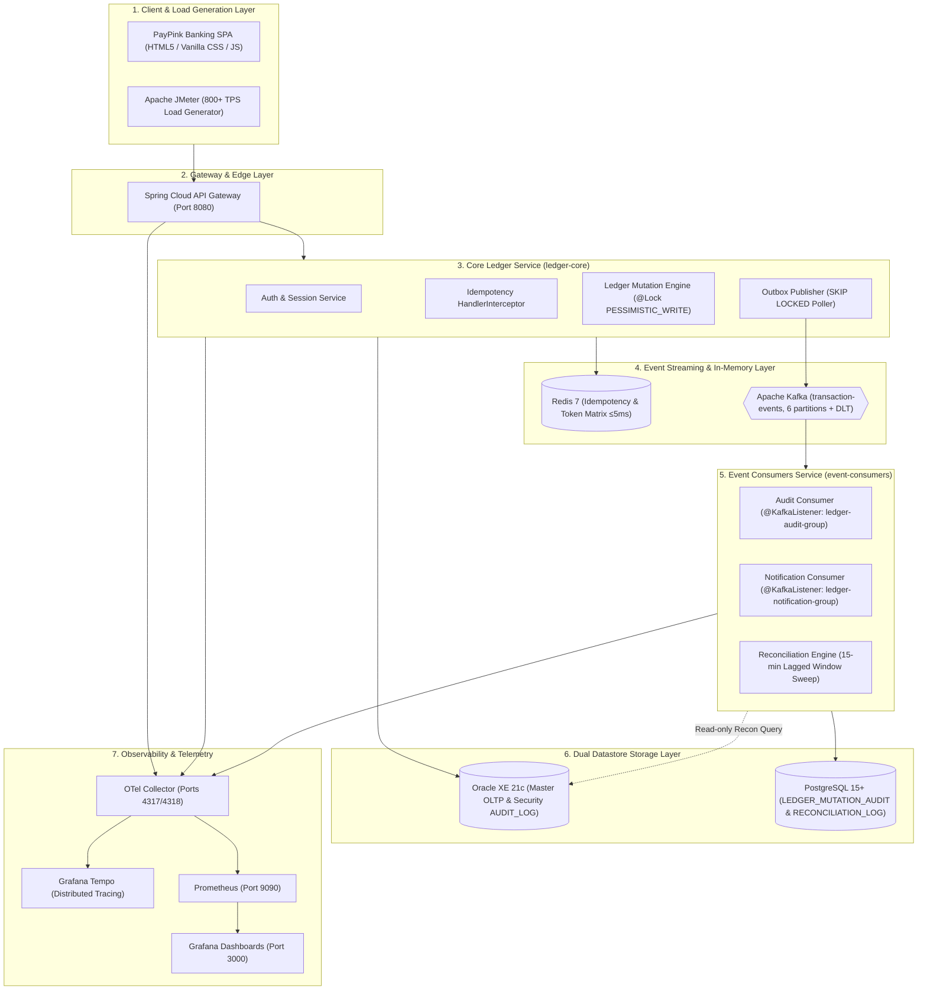
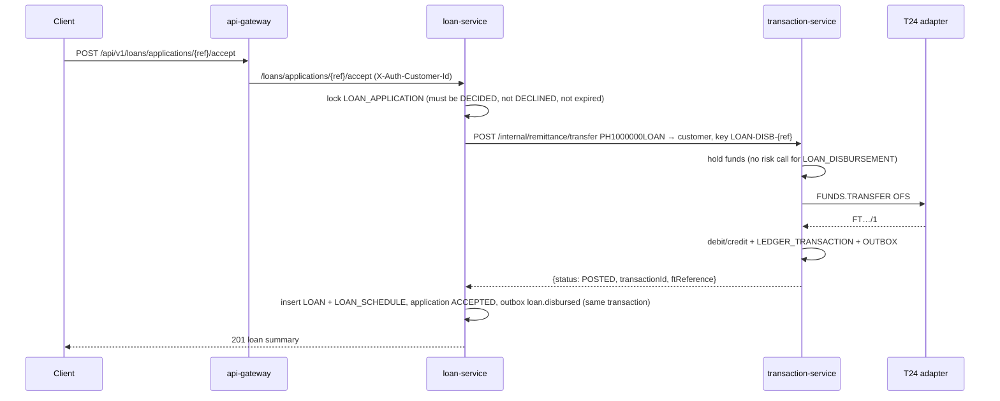

# System Architecture & Technical Specifications

## Capstone FSE: Core Retail Ledger & Balance Mutation Engine

### 1. Executive Summary & Core Topology
The **PayPink Core Retail Ledger & Balance Mutation Engine** is a high-throughput, banking-grade financial ledger platform designed for high-concurrency balance mutations ($\ge 800\text{ TPS}$ with $\le 50\text{ms}$ P95 latency), distributed in-memory validation, and asynchronous audit trail propagation.

---

### 2. Design Decision: Transactional Outbox over Dual-Write

#### The Dual-Write Fallacy
In distributed architectures, attempting to write synchronously to two heterogeneous datastores (e.g., Oracle XE master state and PostgreSQL immutable audit) within the same application request introduces severe consistency hazards:
1. **Lack of Distributed Atomicity**: There is no atomic two-phase commit (2PC) across non-XA heterogeneous datasources without prohibitive latency penalties.
2. **Partial Failures**: If Oracle commits successfully but PostgreSQL fails (or network partitions occur), the primary ledger balance updates while the audit trail is permanently lost. Conversely, if PostgreSQL commits first and Oracle rolls back due to a constraint violation, phantom audit records exist.

#### The Transactional Outbox Solution
PayPink eliminates dual-write hazards via the **Transactional Outbox Pattern**:
* **Single Local Oracle ACID Boundary**: The mutation engine modifies the source/target account balances, records the financial `TRANSACTION`, creates a synchronous security `AUDIT_LOG`, and inserts an `OUTBOX_EVENT` (`status = 'PENDING'`) **within a single Oracle commit**.
* **At-Least-Once Delivery**: The `OutboxPublisherService` claims pending outbox rows using `SELECT ... FOR UPDATE SKIP LOCKED` and streams them to Apache Kafka (`transaction-events`).
* **Idempotent Consumers**: Downstream PostgreSQL consumers enforce idempotency via unique constraints (`uq_audit_tx_account` on `(transaction_id, account_id)` and `reference_no` on notifications), safely discarding duplicates on replay.
* **Lagged Reconciliation Sweep**: An asynchronous `@Scheduled` 15-minute reconciliation engine compares rolling time-window transactions (`now - 20m` to `now - 2m`) between Oracle and PostgreSQL to detect and alert on any cross-store data drift.

---

### 3. System Architecture Diagram

---

### 4. Database Topology (Dual-Store Strategy)

| Database Store | Tables Hosted | Primary Purpose |
| :--- | :--- | :--- |
| **Oracle XE 21c** | `CUSTOMER`, `ACCOUNT`, `TRANSACTION`, `OUTBOX_EVENT`, `AUDIT_LOG` | **Master OLTP & Security Engine**: Dedicated to low-latency balance mutations with `@Lock(LockModeType.PESSIMISTIC_WRITE)`, ordered dual-account locking (`min(src,tgt)` then `max(src,tgt)`), and synchronous security audit records. |
| **PostgreSQL 15+** | `LEDGER_MUTATION_AUDIT`, `RECONCILIATION_LOG`, `NOTIFICATION` | **Immutable Audit & Downstream Store**: Append-only double-entry financial audit entries with `uq_audit_tx_account`, cross-database drift logs, and customer notification dispatch history. |
| **Redis** | `idempotency:{key}`, `token:{jti}` | In-memory distributed token validation and request deduplication matrix achieving **$\le 5\text{ms}$** operational turnaround. |

---

### 5. 11-Step Event Lifecycle

1. **Client Submits Mutation**: Client submits transfer payload with JWT Bearer and `Idempotency-Key` header.
2. **Idempotency Interceptor**: Intercepts request in `<5ms`. If cached, returns completed JSON (`Idempotent-Replay: true`); if in-flight, returns `409 Conflict`; if new, reserves key (`IN_PROGRESS`).
3. **JSR-380 Validation**: Validates `@Digits(integer=14, fraction=4)` and `@Positive`. Violations return RFC-7807 Problem Details.
4. **Ordered Pessimistic Locking**: Locks accounts in ascending numerical ID order (`Math.min(src, tgt)` then `Math.max(src, tgt)`) via `SELECT ... FOR UPDATE` preventing concurrency race conditions and deadlocks.
5. **Oracle Local Commit**: Atomically updates `ACCOUNT` balance, inserts `TRANSACTION`, writes `AUDIT_LOG`, and writes `OUTBOX_EVENT` with multi-leg `entries[]`.
6. **Transaction Synchronization**: On successful commit, `afterCommit()` marks idempotency key `COMPLETED` in Redis with 24-hour TTL; on rollback, `afterCompletion()` deletes key so client can retry.
7. **Outbox Publisher Sweep**: Background poller claims pending outbox events using `SELECT ... FOR UPDATE SKIP LOCKED`.
8. **Kafka Event Streaming**: Publishes message to `transaction-events` (partition key = `accountId`). Retries with exponential backoff on failure; routes poison pills to `transaction-events.DLT` after 5 attempts.
9. **Audit Consumer**: `ledger-audit-group` writes append-only legs to PostgreSQL `LEDGER_MUTATION_AUDIT`, idempotently skipping duplicate legs.
10. **Notification Consumer**: `ledger-notification-group` dispatches customer alert first, then persists delivery status (`SENT`/`FAILED`/`RETRY`) in PostgreSQL `NOTIFICATION`.
11. **Reconciliation Sweep**: `@Scheduled(cron = "0 */15 * * * *")` sweep checks lagged window (`now-20m` to `now-2m`), comparing Oracle vs PostgreSQL legs and logging any drift into `RECONCILIATION_LOG`.

---

### 6. Non-Functional Performance SLAs (NFRs)
- **Throughput**: $\ge 800\text{ TPS}$ peak concurrent velocity.
- **Latency SLA**: P95 $\le 50\text{ms}$ under peak concurrent execution.
- **Redis Turnaround**: $\le 5\text{ms}$ per token/idempotency check.
- **Connection Pool Isolation**: Oracle HikariCP (`maximum-pool-size=30`, `minimum-idle=5`), Postgres HikariCP (`maximum-pool-size=10`, `minimum-idle=2`).

---

### 7. Phase 6 — Loan Service (`microservices/loan-service`, port 8091)

A customer applies for a personal loan, gets an instant decision from their **hardcoded credit score** (`CUSTOMER.credit_score`), accepts, receives the money in their account, and repays monthly.

| Concern | Design |
| :--- | :--- |
| Routing | Gateway `/api/v1/loans/**` → `loan-service:8091/loans/**` (StripPrefix=2), same JWT filter, rate limiter and `X-Correlation-ID`. `/api/v1/loans/eod/**` requires `ROLE_ADMIN` (checked in `JwtAuthFilter`, and again in loan-service via `X-Auth-Roles`). |
| Identity | loan-service never parses JWTs; it trusts `X-Auth-Customer-Id` / `X-Auth-Roles`, which the gateway strips from incoming requests and sets from the verified token. |
| Money movement | **Only** through transaction-service: `POST /internal/remittance/transfer` (header `X-Internal-Service: loan-service`). That path has no gateway route, so it is reachable only on the Docker network. loan-service never updates `ACCOUNT`. |
| Bank funds | Internal account `PH1000000LOAN` (`account_type = INTERNAL`, owner `paypink_bank`, seeded with ₱50,000,000). |
| Risk | `LOAN_DISBURSEMENT` skips the risk engine (the bank is the sender). `LOAN_REPAYMENT` runs the normal risk → hold → T24 → ledger flow. |
| Events | `loan.application.decided`, `loan.disbursed`, `loan.repayment.posted`, `loan.installment.overdue`, `loan.closed` — `OUTBOX_EVENT` rows with `transaction_id = NULL` and `aggregate_id` = the reference, saved in the same DB transaction as the state change. outbox-publisher keys them by `aggregate_id`. notification-service sends an SMS-style alert; audit, analytics and reconciliation ignore `loan.*`. |
| Data | `LOAN_APPLICATION`, `LOAN`, `LOAN_SCHEDULE`, `LOAN_REPAYMENT` in Azure SQL (see `docs/ERD.md`). Money is `BigDecimal`, rounded `HALF_EVEN` to 2 dp. |

**Decision rules** (`loan:` in `application.yml`): overdue loan → DECLINED; score < 500 → DECLINED; band LOW (300–579: ₱30k, 28%, 12 mo) / NORMAL (580–719: ₱250k, 18%, 36 mo) / HIGH (720–850: ₱1M, 10.5%, 60 mo) caps amount and term; installment > 30% of monthly income → DECLINED; nothing capped → APPROVED, else COUNTER_OFFER. Offers are valid 7 days.

**Accept / disburse** — one DB transaction holds a `WITH (UPDLOCK, ROWLOCK)` lock on the application while calling the orchestrator (3 s timeout), so concurrent accepts serialize:

On `REJECTED`, `PENDING_CORE` or a timeout, loan-service rolls back and returns `503 core-unavailable`. A retry reuses the fixed transfer key, so the orchestrator replays the earlier result instead of moving money twice. The orchestrator now caches only final (`POSTED`) results in Redis, so a retry after the saga worker finishes sees `POSTED`.

**Repay** — lock `LOAN`, transfer customer → `PH1000000LOAN` (`LOAN_REPAYMENT`, key `LOAN-REPAY-{Idempotency-Key}`), then apply the money to `penalty_due` first and the oldest unpaid installments (interest before principal). Insufficient balance → `422 insufficient-funds`, nothing saved. All rows paid → `CLOSED` + `loan.closed`.

**EOD** — `@Scheduled(cron = "0 5 0 * * *", zone = "Asia/Manila")`, or `POST /loans/eod/run?businessDate=` (admin). Every `PENDING` installment due before the business date becomes `OVERDUE` with a one-time 2% penalty (`penalty_charged`), and the loan becomes `OVERDUE`. Running it twice for the same date changes nothing. LOAN rows are always locked before LOAN_SCHEDULE rows (same order as repayments) to avoid deadlocks.
