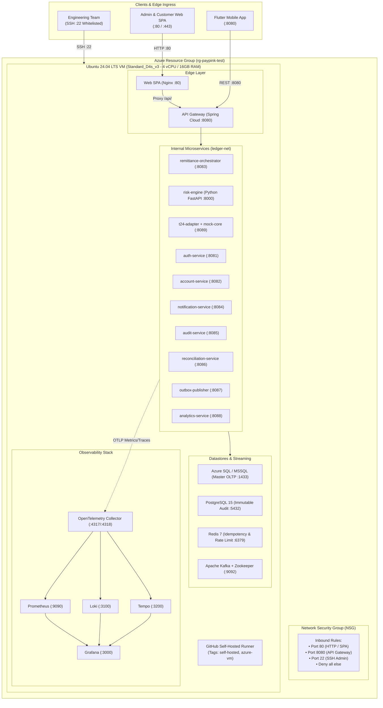
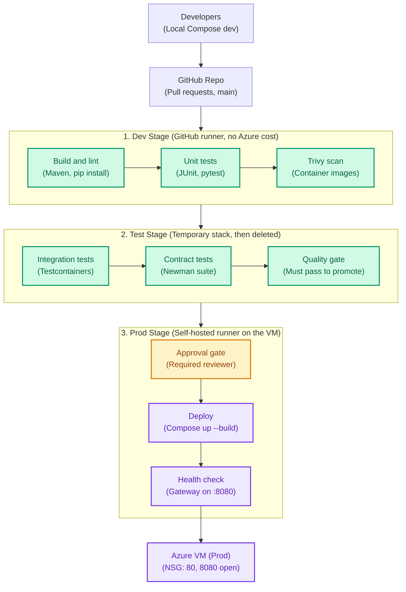

# PayPink 2.0 — Azure Cloud & CI/CD Deployment Guide
**Omnichannel Remittance, Real-Time Fraud Screening & Core Retail Ledger**

---

## 1. Cloud Architecture & Pipeline Stage Topology

### Infrastructure Topology
PayPink 2.0 is hosted on Microsoft Azure as a containerized microservice matrix running on an Ubuntu 24.04 LTS Virtual Machine (`Standard_D4s_v3`) orchestrated by Docker Compose.



---

## 2. CI/CD Pipeline Stages Architecture

PayPink 2.0 uses a 3-stage CI/CD pipeline. **Dev and Test use free GitHub cloud runners (no Azure cost)**; nothing deploys to Azure until approved.



---

## 3. Azure Budget Optimization ($10 Cloud Budget Strategy)

### The Math:
* A `Standard_D4s_v3` instance (4 vCPU, 16 GiB RAM) costs approximately **~$0.192 per hour**.
* **$10 total credit = ~52 hours of active runtime.**
* Running continuously 24/7 would deplete the budget in **~2.1 days**.

### Mandatory Cost Control Protocols:
1. **Always Deallocate (Not just Stop inside Linux):**
   ```bash
   az vm deallocate --resource-group "rg-azuser8406_mml.local-722QP" --name "vm-paypink-test"
   ```
2. **Auto-Shutdown Schedule (Every day at 7:00 PM PHT / 11:00 UTC):**
   ```bash
   az vm auto-shutdown \
     --resource-group "rg-azuser8406_mml.local-722QP" \
     --name "vm-paypink-test" \
     --time "1100" \
     --email "your-email@example.com"
   ```
3. **Configure a Stable DNS Name (Preserves URL across deallocations):**
   ```bash
   az network public-ip update \
     --resource-group "rg-azuser8406_mml.local-722QP" \
     --name "vm-paypink-testPublicIP" \
     --dns-name "paypink-demo-ph"
   ```
   **Permanent URL:** `http://paypink-demo-ph.centralindia.cloudapp.azure.com` (or `.eastus.cloudapp.azure.com`).

---

## 4. Step-by-Step Deployment Walkthrough

### Phase 1: Provision Azure Infrastructure via CLI

```bash
# 1. Variables
RESOURCE_GROUP="rg-azuser8406_mml.local-722QP"   # Use your assigned resource group
LOCATION="centralindia"                         # Or "eastus" / "southeastasia"
VM_NAME="vm-paypink-test"
VM_SIZE="Standard_D4s_v3"
ADMIN_USER="azureuser"

# 2. Create NSG with Ports 80, 8080, and 22
az network nsg create \
  --resource-group "$RESOURCE_GROUP" \
  --name "${VM_NAME}-nsg" \
  --location "$LOCATION"

az network nsg rule create --resource-group "$RESOURCE_GROUP" --nsg-name "${VM_NAME}-nsg" \
  --name "Allow-HTTP-SPA" --priority 100 --direction Inbound --access Allow --protocol Tcp --destination-port-ranges 80

az network nsg rule create --resource-group "$RESOURCE_GROUP" --nsg-name "${VM_NAME}-nsg" \
  --name "Allow-API-Gateway" --priority 110 --direction Inbound --access Allow --protocol Tcp --destination-port-ranges 8080

az network nsg rule create --resource-group "$RESOURCE_GROUP" --nsg-name "${VM_NAME}-nsg" \
  --name "Allow-SSH" --priority 120 --direction Inbound --access Allow --protocol Tcp --destination-port-ranges 22

# 3. Create Ubuntu 24.04 VM with Premium/Standard SSD
az vm create \
  --resource-group "$RESOURCE_GROUP" \
  --name "$VM_NAME" \
  --location "$LOCATION" \
  --image "Canonical:ubuntu-24_04-lts:server:latest" \
  --size "$VM_SIZE" \
  --admin-username "$ADMIN_USER" \
  --generate-ssh-keys \
  --nsg "${VM_NAME}-nsg" \
  --public-ip-sku Standard \
  --os-disk-size-gb 64 \
  --storage-sku StandardSSD_LRS
```

---

### Phase 2: Ubuntu VM Host Bootstrapping

SSH into the VM:
```bash
ssh azureuser@<VM_PUBLIC_IP>
```

Execute the bootstrap script:
```bash
# 1. Upgrade & 4GB Swap Space
sudo apt update && sudo apt upgrade -y
sudo fallocate -l 4G /swapfile && sudo chmod 600 /swapfile
sudo mkswap /swapfile && sudo swapon /swapfile
echo '/swapfile none swap sw 0 0' | sudo tee -a /etc/fstab

# 2. Install Docker Engine, Compose & Build Tools
sudo apt install -y ca-certificates curl gnupg lsb-release git openjdk-17-jdk maven python3-pip
sudo install -m 0755 -d /etc/apt/keyrings
curl -fsSL https://download.docker.com/linux/ubuntu/gpg | sudo gpg --dearmor -o /etc/apt/keyrings/docker.gpg
sudo chmod a+r /etc/apt/keyrings/docker.gpg

echo \
  "deb [arch=$(dpkg --print-architecture) signed-by=/etc/apt/keyrings/docker.gpg] https://download.docker.com/linux/ubuntu \
  noble stable" | sudo tee /etc/apt/sources.list.d/docker.list > /dev/null

sudo apt update
sudo apt install -y docker-ce docker-ce-cli containerd.io docker-buildx-plugin docker-compose-plugin

# 3. Non-Root Docker Access
sudo usermod -aG docker $USER
sudo chmod 666 /var/run/docker.sock
```

---

### Phase 3: Setup GitHub Self-Hosted Runner on VM

1. In GitHub Repository $\rightarrow$ **Settings** $\rightarrow$ **Actions** $\rightarrow$ **Runners** $\rightarrow$ **New self-hosted runner** (Linux / x64).
2. Run the registration snippet on the VM:
   ```bash
   mkdir -p ~/actions-runner && cd ~/actions-runner
   curl -o actions-runner-linux-x64-2.321.0.tar.gz -L https://github.com/actions/runner/releases/download/v2.321.0/actions-runner-linux-x64-2.321.0.tar.gz
   tar xzf ./actions-runner-linux-x64-2.321.0.tar.gz

   # Register with specific labels: [self-hosted, azure-vm]
   ./config.sh --url https://github.com/TechStart-Integration-Capstone/Integrated-Capstone \
     --token <YOUR_RUNNER_TOKEN> \
     --labels "self-hosted,azure-vm" --unattended

   # Install & start as background service
   sudo ./svc.sh install
   sudo ./svc.sh start
   ```

---

### Phase 4: Production CI/CD Pipeline Workflow

The workflow file [`.github/workflows/pipeline.yml`](file:///.github/workflows/pipeline.yml) maps 1:1 to our 3-stage architecture:

```
Developers (Local Compose) ──▶ GitHub Repo 
                                  │
   ┌──────────────────────────────┴──────────────────────────────┐
   │ 1. Dev Stage (GitHub Runner - $0)                           │
   │    • Build & Lint (Maven, pip install)                      │
   │    • Unit Tests (JUnit 5, pytest)                           │
   │    • Trivy Scan (Container & FS security)                   │
   └──────────────────────────────┬──────────────────────────────┘
                                  ▼
   ┌─────────────────────────────────────────────────────────────┐
   │ 2. Test Stage (Temporary Stack, Then Deleted)               │
   │    • Integration Tests (Testcontainers / Compose syntax)    │
   │    • Contract Tests (Newman Postman collection)             │
   │    • Quality Gate (Must pass to promote)                    │
   └──────────────────────────────┬──────────────────────────────┘
                                  ▼
   ┌─────────────────────────────────────────────────────────────┐
   │ 3. Prod Stage (Self-Hosted Runner on Azure VM)              │
   │    • Approval Gate (Required reviewer / manual release)     │
   │    • Deploy (docker compose up -d --build)                  │
   │    • Health Check (Gateway probe on :8080 for 180s)         │
   │    • Image Prune (Disk maintenance)                         │
   └──────────────────────────────┬──────────────────────────────┘
                                  ▼
                       Azure VM (Prod Live Host)
```

---

## 5. Verification, Health Checks & URLs

| Component | Target URL |
| :--- | :--- |
| **Web SPA (Nginx :80)** | `http://<DNS_NAME_OR_PUBLIC_IP>` |
| **API Gateway Health (:8080)** | `http://<DNS_NAME_OR_PUBLIC_IP>:8080/actuator/health` |
| **Grafana Monitoring Stack** | `ssh -L 3000:localhost:3000 azureuser@<VM_PUBLIC_IP>` $\rightarrow$ `http://localhost:3000` |

### Default Seed Banking Credentials:
* **User 1:** `lviernes` / `password123` (Accounts: ₱125,450.00 / ₱50,000.00)
* **User 2:** `arosales` / `password123` (Savings: ₱84,320.50)
* **User 3:** `glim` / `password123` (Time Deposit: ₱350,000.00)
