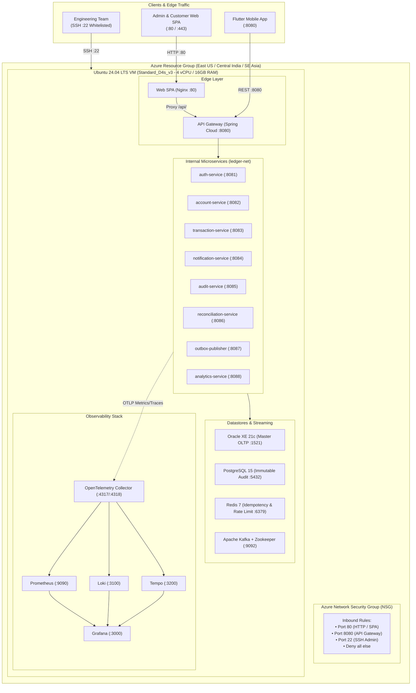

# PayPink 2.0 — Azure Cloud Deployment Guide
**Omnichannel Remittance, Real-Time Fraud Screening & Core Retail Ledger**

---

## 1. Architecture Overview

PayPink 2.0 is hosted on Microsoft Azure as a single-host containerized microservice matrix running inside an Ubuntu 24.04 LTS Virtual Machine orchestrated by Docker Compose.



---

## 2. Infrastructure Sizing & Prerequisites

| Resource | Value / SKU | Reason |
| :--- | :--- | :--- |
| **Azure VM SKU** | `Standard_D4s_v3` (4 vCPU, 16 GiB RAM) | Accommodates 9 Spring Boot JVMs, Python, Oracle XE, Postgres, Kafka & Grafana |
| **OS Image** | `Canonical:ubuntu-24_04-lts:server:latest` | Modern LTS with native Docker support |
| **Disk** | 64 GB Standard SSD (`StandardSSD_LRS`) | Fast persistent storage for container layers & DB volumes |
| **Host Swap** | 4 GB Swapfile | Buffer against burst memory pressure during stress testing |
| **Network Ports** | `80` (HTTP), `8080` (Gateway), `22` (SSH) | Least-privilege ingress via Azure NSG |

---

## 3. Step-by-Step Deployment Walkthrough

### Phase 1: Provision Azure Cloud Infrastructure (CLI)

Run these commands in Azure Cloud Shell or your local PowerShell terminal:

```bash
# 1. Define Variables (Adjust RG & Location to your environment)
RESOURCE_GROUP="rg-azuser8406_mml.local-722QP"   # Or your assigned Resource Group
LOCATION="eastus"                         # Or "eastus" / "southeastasia"
VM_NAME="vm-paypink-test"
VM_SIZE="Standard_D4s_v3"
ADMIN_USER="azureuser"

# 2. Create Network Security Group (NSG)
az network nsg create \
  --resource-group "$RESOURCE_GROUP" \
  --name "${VM_NAME}-nsg" \
  --location "$LOCATION"

# 3. Add Inbound Security Rules
# Port 80 - Web SPA
az network nsg rule create \
  --resource-group "$RESOURCE_GROUP" \
  --nsg-name "${VM_NAME}-nsg" \
  --name "Allow-HTTP-SPA" \
  --priority 100 \
  --direction Inbound \
  --access Allow \
  --protocol Tcp \
  --destination-port-ranges 80

# Port 8080 - API Gateway
az network nsg rule create \
  --resource-group "$RESOURCE_GROUP" \
  --nsg-name "${VM_NAME}-nsg" \
  --name "Allow-API-Gateway" \
  --priority 110 \
  --direction Inbound \
  --access Allow \
  --protocol Tcp \
  --destination-port-ranges 8080

# Port 22 - SSH Remote Access
az network nsg rule create \
  --resource-group "$RESOURCE_GROUP" \
  --nsg-name "${VM_NAME}-nsg" \
  --name "Allow-SSH" \
  --priority 120 \
  --direction Inbound \
  --access Allow \
  --protocol Tcp \
  --destination-port-ranges 22

# 4. Provision the Ubuntu Virtual Machine
az vm create \
  --resource-group "$RESOURCE_GROUP" \
  --name "$VM_NAME" \
  --location "$LOCATION" \
  --image "Canonical:ubuntu-24_04-lts:server:latest" \
  --size "$VM_SIZE" \
  --admin-username "$ADMIN_USER" \
  --generate-ssh-keys \
  --nsg "${VM_NAME}-nsg" \
  --public-ip-sku Standard \
  --os-disk-size-gb 64 \
  --storage-sku StandardSSD_LRS
```

*Note the `publicIpAddress` outputted upon VM creation.*

---

### Phase 2: Ubuntu VM Host Bootstrapping

SSH into your new VM:
```bash
ssh azureuser@<VM_PUBLIC_IP>
```

Run the host setup script to configure swap memory and install Docker Engine & Buildx:

```bash
# 1. Update OS Packages
sudo apt update && sudo apt upgrade -y

# 2. Configure 4GB Swap Space
sudo fallocate -l 4G /swapfile
sudo chmod 600 /swapfile
sudo mkswap /swapfile
sudo swapon /swapfile
echo '/swapfile none swap sw 0 0' | sudo tee -a /etc/fstab

# 3. Install Docker CE, Compose & Build Tools
sudo apt install -y ca-certificates curl gnupg lsb-release git openjdk-17-jdk maven
sudo install -m 0755 -d /etc/apt/keyrings
curl -fsSL https://download.docker.com/linux/ubuntu/gpg | sudo gpg --dearmor -o /etc/apt/keyrings/docker.gpg
sudo chmod a+r /etc/apt/keyrings/docker.gpg

echo \
  "deb [arch=$(dpkg --print-architecture) signed-by=/etc/apt/keyrings/docker.gpg] https://download.docker.com/linux/ubuntu \
  noble stable" | sudo tee /etc/apt/sources.list.d/docker.list > /dev/null

sudo apt update
sudo apt install -y docker-ce docker-ce-cli containerd.io docker-buildx-plugin docker-compose-plugin

# 4. Configure User Permissions & Docker Socket
sudo usermod -aG docker $USER
sudo chmod 666 /var/run/docker.sock
```

---

### Phase 3: Clone Codebase & Build Microservice JARs

```bash
# 1. Clone the repository
cd ~
git clone https://github.com/TechStart-Integration-Capstone/Integrated-Capstone.git
cd Integrated-Capstone

# 2. Download OpenTelemetry Java Instrumentation Agent
if [ ! -f microservices/opentelemetry-javaagent.jar ]; then
  curl -L -o microservices/opentelemetry-javaagent.jar \
    https://github.com/open-telemetry/opentelemetry-java-instrumentation/releases/latest/download/opentelemetry-javaagent.jar
fi

# Copy OTel agent to all microservice build folders
for svc in api-gateway auth-service account-service transaction-service notification-service audit-service reconciliation-service outbox-publisher analytics-service; do
  cp microservices/opentelemetry-javaagent.jar microservices/$svc/
done

# 3. Compile and Package all Java Microservices
for svc in api-gateway auth-service account-service transaction-service notification-service audit-service reconciliation-service outbox-publisher analytics-service; do
  echo "Packaging $svc..."
  mvn -f microservices/$svc/pom.xml clean package -DskipTests
done

# 4. Verify all JARs were generated
ls -lh microservices/*/target/*.jar
```

---

### Phase 4: Configure Port Mapping & Launch Docker Stack

```bash
cd ~/Integrated-Capstone

# 1. Create unified database initialization scripts
cat backend/event-consumers/src/main/resources/schema-postgres.sql \
    backend/notification-service/src/main/resources/schema-postgres.sql \
    > docker/init-postgres.sql

cat backend/ledger-core/src/main/resources/schema-oracle.sql \
    > docker/init-oracle.sql

# 2. Align docker-compose.yml with local init scripts & host Port 80
sed -i 's|\./\.\./backend/src/main/resources/schema-oracle\.sql|./init-oracle.sql|' docker/docker-compose.yml
sed -i 's|\./\.\./backend/src/main/resources/schema-postgres\.sql|./init-postgres.sql|' docker/docker-compose.yml
sed -i 's/"3001:80"/"80:80"/' docker/docker-compose.yml

# 3. Start all containers in background
cd docker
docker compose up -d --build
```

---

### Phase 5: Seed Relational Database Tables & Accounts

Execute this block to ensure all Oracle XE (OLTP) and PostgreSQL (Audit) tables and seed data are populated:

```bash
# 1. Seed Oracle XE (XEPDB1 Pluggable Database)
docker exec -i oracle-xe-master sqlplus ledger_master/MasterSecretPassword123@localhost:1521/XEPDB1 << 'EOF'
-- 1. CUSTOMER TABLE
CREATE TABLE CUSTOMER (
    customer_id      NUMBER(19) GENERATED ALWAYS AS IDENTITY PRIMARY KEY,
    username         VARCHAR2(50) NOT NULL UNIQUE,
    password_hash    VARCHAR2(255) NOT NULL,
    first_name       VARCHAR2(100) NOT NULL,
    last_name        VARCHAR2(100) NOT NULL,
    email            VARCHAR2(150) NOT NULL UNIQUE,
    contact_no       VARCHAR2(30) NOT NULL,
    status           VARCHAR2(20) DEFAULT 'ACTIVE' NOT NULL,
    created_date     TIMESTAMP DEFAULT CURRENT_TIMESTAMP NOT NULL
);

-- 2. ACCOUNT TABLE
CREATE TABLE ACCOUNT (
    account_id       NUMBER(19) GENERATED ALWAYS AS IDENTITY PRIMARY KEY,
    customer_id      NUMBER(19) NOT NULL,
    account_number   VARCHAR2(30) NOT NULL UNIQUE,
    account_type     VARCHAR2(30) DEFAULT 'SAVINGS' NOT NULL,
    currency         VARCHAR2(10) DEFAULT 'PHP' NOT NULL,
    current_balance  NUMBER(18,4) DEFAULT 0.0000 NOT NULL,
    status           VARCHAR2(20) DEFAULT 'ACTIVE' NOT NULL,
    created_date     TIMESTAMP DEFAULT CURRENT_TIMESTAMP NOT NULL,
    CONSTRAINT fk_account_customer FOREIGN KEY (customer_id) REFERENCES CUSTOMER(customer_id),
    CONSTRAINT chk_account_balance_positive CHECK (current_balance >= 0.0000)
);

-- 3. AUDIT_LOG TABLE
CREATE TABLE AUDIT_LOG (
    audit_id         NUMBER(19) GENERATED ALWAYS AS IDENTITY PRIMARY KEY,
    customer_id      NUMBER(19) NOT NULL,
    action           VARCHAR2(50) NOT NULL,
    entity           VARCHAR2(50) NOT NULL,
    details          VARCHAR2(4000) NOT NULL,
    status           VARCHAR2(20) NOT NULL,
    timestamp        TIMESTAMP DEFAULT CURRENT_TIMESTAMP NOT NULL
);

-- 4. TRANSACTION TABLE
CREATE TABLE TRANSACTION (
    transaction_id   NUMBER(19) GENERATED ALWAYS AS IDENTITY PRIMARY KEY,
    from_account_id  NUMBER(19) NOT NULL,
    to_account_id    NUMBER(19) NOT NULL,
    amount           NUMBER(18,4) NOT NULL,
    fee              NUMBER(18,4) DEFAULT 0.0000 NOT NULL,
    currency         VARCHAR2(10) DEFAULT 'PHP' NOT NULL,
    status           VARCHAR2(20) DEFAULT 'PENDING' NOT NULL,
    reference_no     VARCHAR2(64) NOT NULL UNIQUE,
    description      VARCHAR2(255),
    created_date     TIMESTAMP DEFAULT CURRENT_TIMESTAMP NOT NULL,
    completed_date   TIMESTAMP,
    CONSTRAINT fk_tx_from_account FOREIGN KEY (from_account_id) REFERENCES ACCOUNT(account_id),
    CONSTRAINT fk_tx_to_account FOREIGN KEY (to_account_id) REFERENCES ACCOUNT(account_id)
);

-- 5. OUTBOX_EVENT TABLE
CREATE TABLE OUTBOX_EVENT (
    event_id         NUMBER(19) GENERATED ALWAYS AS IDENTITY PRIMARY KEY,
    transaction_id   NUMBER(19) NOT NULL,
    event_type       VARCHAR2(50) NOT NULL,
    payload          CLOB NOT NULL,
    status           VARCHAR2(20) DEFAULT 'PENDING' NOT NULL,
    created_date     TIMESTAMP DEFAULT CURRENT_TIMESTAMP NOT NULL,
    processed_date   TIMESTAMP,
    CONSTRAINT fk_outbox_transaction FOREIGN KEY (transaction_id) REFERENCES TRANSACTION(transaction_id)
);

-- Seed Retail Customers with BCrypt password for 'password123'
INSERT INTO CUSTOMER (username, password_hash, first_name, last_name, email, contact_no, status)
VALUES ('lviernes', '$2b$10$nQqX3kBciCLYCyofDR3b6Oy4X/.99Bap8d49IpzN3D8MCj20TuJOO', 'Levi', 'Viernes', 'jonlevi.jlv@gmail.com', '+63 922 758 4285', 'ACTIVE');

INSERT INTO CUSTOMER (username, password_hash, first_name, last_name, email, contact_no, status)
VALUES ('arosales', '$2b$10$nQqX3kBciCLYCyofDR3b6Oy4X/.99Bap8d49IpzN3D8MCj20TuJOO', 'Aly', 'Rosales', 'aly.rosales@paypink.ph', '+63 918 555 6789', 'ACTIVE');

INSERT INTO CUSTOMER (username, password_hash, first_name, last_name, email, contact_no, status)
VALUES ('glim', '$2b$10$nQqX3kBciCLYCyofDR3b6Oy4X/.99Bap8d49IpzN3D8MCj20TuJOO', 'Gill', 'Lim', 'gill.lim@paypink.ph', '+63 920 333 4567', 'ACTIVE');

-- Seed Accounts with Philippine Peso (PHP / ₱) Balances
INSERT INTO ACCOUNT (customer_id, account_number, account_type, currency, current_balance, status)
VALUES (1, 'ACC-PH-1001-8842', 'SAVINGS_ACCOUNT', 'PHP', 125450.0000, 'ACTIVE');

INSERT INTO ACCOUNT (customer_id, account_number, account_type, currency, current_balance, status)
VALUES (1, 'ACC-PH-1001-9921', 'CHECKING_ACCOUNT', 'PHP', 50000.0000, 'ACTIVE');

INSERT INTO ACCOUNT (customer_id, account_number, account_type, currency, current_balance, status)
VALUES (1, 'ACC-PH-1001-7714', 'STRESS_TEST_ACCOUNT', 'PHP', 60.0000, 'ACTIVE');

INSERT INTO ACCOUNT (customer_id, account_number, account_type, currency, current_balance, status)
VALUES (2, 'ACC-PH-2002-3311', 'SAVINGS_ACCOUNT', 'PHP', 84320.5000, 'ACTIVE');

INSERT INTO ACCOUNT (customer_id, account_number, account_type, currency, current_balance, status)
VALUES (3, 'ACC-PH-3003-4422', 'TIME_DEPOSIT', 'PHP', 350000.0000, 'ACTIVE');

COMMIT;
EXIT;
EOF

# 2. Seed PostgreSQL Immutable Audit & Notification Tables
docker exec -i postgres-immutable-audit psql -U audit_user -d ledger_audit_db << 'EOF'
CREATE TABLE IF NOT EXISTS LEDGER_MUTATION_AUDIT (
    audit_id         BIGSERIAL PRIMARY KEY,
    transaction_id   BIGINT NOT NULL,
    account_id       BIGINT NOT NULL,
    entry_type       VARCHAR(10) NOT NULL CHECK (entry_type IN ('DEBIT', 'CREDIT')),
    amount           NUMERIC(18,4) NOT NULL CHECK (amount > 0.0000),
    currency         VARCHAR(10) DEFAULT 'PHP' NOT NULL,
    before_balance   NUMERIC(18,4) NOT NULL,
    after_balance    NUMERIC(18,4) NOT NULL,
    created_date     TIMESTAMPTZ DEFAULT CURRENT_TIMESTAMP NOT NULL,
    CONSTRAINT uq_audit_tx_account UNIQUE (transaction_id, account_id)
);

CREATE TABLE IF NOT EXISTS RECONCILIATION_LOG (
    recon_id         BIGSERIAL PRIMARY KEY,
    transaction_id   BIGINT NOT NULL,
    account_id       BIGINT NOT NULL,
    oracle_status    VARCHAR(30) NOT NULL,
    postgres_status  VARCHAR(30) NOT NULL,
    recon_status     VARCHAR(30) NOT NULL,
    mismatch_fields  VARCHAR(200),
    check_count      INT DEFAULT 1 NOT NULL,
    last_checked_at  TIMESTAMPTZ DEFAULT CURRENT_TIMESTAMP NOT NULL,
    recon_date       TIMESTAMPTZ DEFAULT CURRENT_TIMESTAMP NOT NULL,
    CONSTRAINT uq_recon_tx_account UNIQUE (transaction_id, account_id)
);

CREATE TABLE IF NOT EXISTS NOTIFICATION (
    notification_id  BIGSERIAL PRIMARY KEY,
    customer_id      BIGINT NOT NULL,
    account_id       BIGINT NOT NULL,
    reference_no     VARCHAR(64) NOT NULL,
    message          TEXT NOT NULL,
    status           VARCHAR(20) NOT NULL CHECK (status IN ('PENDING', 'SENT', 'FAILED', 'RETRY')),
    created_date     TIMESTAMPTZ DEFAULT CURRENT_TIMESTAMP NOT NULL,
    updated_date     TIMESTAMPTZ,
    CONSTRAINT uq_notification_ref_account UNIQUE (reference_no, account_id)
);
EOF
```

---

## 6. Verification & Testing

### Live URLs:
* **Web SPA Application:** `http://<VM_PUBLIC_IP>` (e.g., `http://20.204.1.219`)
* **API Gateway Health Check:** `http://<VM_PUBLIC_IP>:8080/actuator/health`

### Demo Login Credentials:
* **Username:** `lviernes` (or `arosales`, `glim`)
* **Password:** `password123`

### Accessing Grafana & Observability:
Forward port `3000` securely via SSH:
```bash
ssh -L 3000:localhost:3000 azureuser@<VM_PUBLIC_IP>
```
Then visit `http://localhost:3000` (User: `admin` / Password: `admin`).

---

## 7. Troubleshooting & Reference Matrix

| Issue | Root Cause | Resolution |
| :--- | :--- | :--- |
| `AuthorizationFailed` on `az group create` | Subscription policy disallows creating root resource groups. | Use pre-assigned Resource Group from `az group list --output table`. |
| `RequestDisallowedByPolicy` on VM size | Subscription policy restricts VM SKU whitelist. | Use `Standard_D4s_v3` (4 vCPU / 16GB RAM) which is permitted. |
| `permission denied while trying to connect to docker API` | Non-root user lacks socket permission. | Run `sudo chmod 666 /var/run/docker.sock`. |
| `ORA-00942: table or view does not exist` | Oracle XE runs against `XEPDB1` pluggable database. | Specify `@localhost:1521/XEPDB1` in `sqlplus` connection string. |
