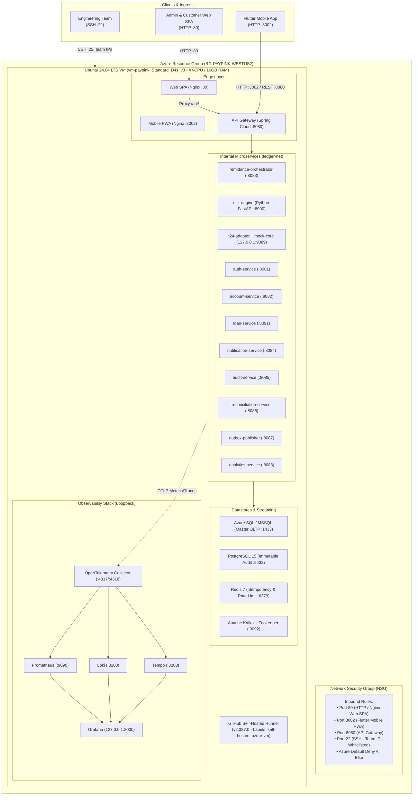
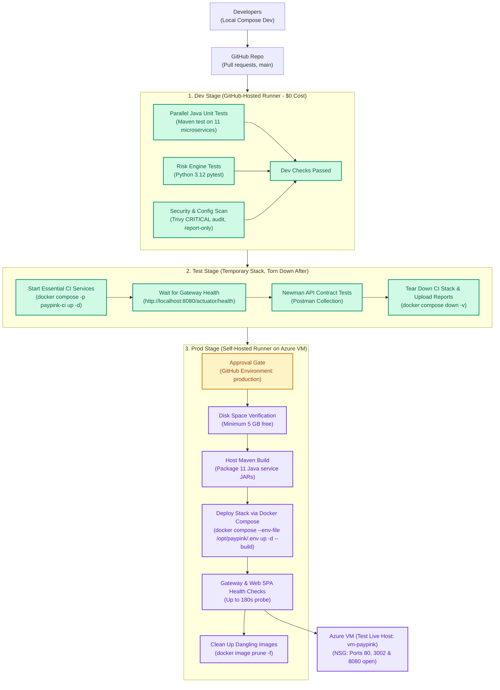

# PayPink 2.0 — Azure Cloud & CI/CD Deployment Guide
**Omnichannel Remittance, Real-Time Fraud Screening & Core Retail Ledger**
*(Test & Evaluation Environment: West US 2 / Standard_D4s_v3)*

> [!NOTE]
> **Environment Context & Architecture Mapping:**
> This guide describes the active **Test & Sandbox Environment** deployed in Azure region `westus2` on an optimized `Standard_D4s_v3` VM (4 vCPU, 16 GiB RAM) to comply with the strict **$10 cloud budget limit**. The enterprise production specification described in general project architecture targets `Standard_D8s_v5` (8 vCPU, 32 GiB RAM) in `eastasia` / `southeastasia` for high-throughput multi-region resilience.

> [!WARNING]
> **Security & Access Control:**
> The live IP (`20.69.157.88`) and FQDN in this guide are operational references for internal evaluation only. Keep this repository strictly private. Do NOT expose live IP addresses or public hostnames in external slide decks or public demonstrations.

---

## 1. Cloud Architecture & Pipeline Stage Topology

### Infrastructure Topology
PayPink 2.0 is hosted on Microsoft Azure as a containerized microservice matrix running on an Ubuntu 24.04 LTS Virtual Machine (`vm-paypink`: `Standard_D4s_v3`, 4 vCPU / 16 GiB RAM) orchestrated by Docker Compose.



### Memory Footprint & Container Sizing
* **Active Stack on `Standard_D4s_v3` (16 GiB RAM):** Runs the 26 core operational containers (edge gateways, 12 backend microservices, datastores, Kafka, and telemetry collectors) utilizing JVM heap limits (`-XX:MaxRAMPercentage=60`), SQL Server buffer cap (`3072 MB`), and a 4 GiB swap safety partition.
* **Full Enterprise 31-Container Stack:** The un-trimmed enterprise stack (with multi-replica service instances, dedicated chaos simulation workers, and multi-node telemetry clusters) requires **24–26 GiB RAM**, which corresponds to `Standard_D8s_v5`.

---

## 2. CI/CD Pipeline Stages Architecture

PayPink 2.0 uses a 3-stage CI/CD pipeline. **Dev and Test stages use free GitHub cloud runners (zero Azure compute cost)**; deployments to the Azure VM only trigger on the `main` branch after approval.



### Architectural Trade-off: Host Maven Build vs. Multi-Stage Dockerfiles (Task 3 Grading)
* **Design Decision:** The production deployment step on the self-hosted runner executes `mvn -B clean package -DskipTests` on the VM host prior to `docker compose up -d --build`, with Dockerfiles utilizing single-stage runtime images (`eclipse-temurin:17-jre-alpine`).
* **Engineering Rationale:**
  1. *Resource Constraints on 16 GiB VM:* Performing 11 individual multi-stage Docker builds sequentially or concurrently would spin up 11 heavyweight Maven build containers inside Docker, downloading redundant dependencies or triggering extreme disk layer thrashing and Docker daemon locks on a single VM.
  2. *Build Acceleration & Cache Sharing:* Running Maven on the host leverages the shared host `~/.m2/repository` cache across all 11 services. Builds complete in ~1.5 minutes (versus 15+ minutes in Docker) with zero Docker storage bloat.
  3. *Production Parity:* The runtime containers remain lean Alpine JRE images with no compilers, Maven binaries, or build tools included in the deployed artifacts.

### Security Scan Policy: Report-Only Audit Scan
* The **Trivy security scan** step runs with `exit-code: '0'` and `continue-on-error: true`.
* **Purpose:** It operates as an **audit and transparency report** rather than a hard blocking gate. Critical CVEs and configuration warnings are published to the GitHub Actions workflow summary for team visibility without blocking PR merges during sprint iterations.

---

## 3. Azure Budget & Network Governance

### Budget Reality ($10 Cloud Budget Strategy)
* **Compute:** `Standard_D4s_v3` costs **~$0.192 per hour**.
* **Storage & Static IP:** 64 GB SSD and Standard IP cost **~$0.25 to $0.30 per day** even while deallocated.
* **Cost Protocol:**
  1. **Always Deallocate when Inactive (Stopping inside Linux does NOT pause compute billing):**
     ```bash
     az vm deallocate --resource-group "RG-PAYPINK-WESTUS2" --name "vm-paypink"
     ```
  2. **Daily Auto-Shutdown Schedule (7:00 PM PHT / 11:00 UTC):**
     ```bash
     az vm auto-shutdown --resource-group "RG-PAYPINK-WESTUS2" --name "vm-paypink" --time "1100"
     ```

### NSG Rule Management & Dynamic Cloud Shell IPs
* Azure Cloud Shell outbound IPs change dynamically every session. To connect via SSH from Cloud Shell, port 22 in the NSG must allow the connection.
* **Inspect Current Rules:**
  ```bash
  az network nsg rule list -g RG-PAYPINK-WESTUS2 --nsg-name vm-paypink-nsg -o table
  ```
* **Restrict Access:** Replace `TEAM_IPS` placeholders with exact `/32` CIDRs for team members (`curl ifconfig.me`). Never leave port 22 open to `*` or `Any` in production.

### SSH Key Recovery Warning
* Using `az vm user update --ssh-key-value ~/.ssh/id_rsa.pub` updates the public key for `azureuser`, which **replaces** the active `~/.ssh/authorized_keys` file.
* **Teammate Access:** If teammates previously had their SSH keys authorized, their keys will be overwritten. Always re-append teammates' public keys after running a key reset:
  ```bash
  echo "<TEAMMATE_PUBLIC_KEY>" >> ~/.ssh/authorized_keys
  ```

### Performance & Latency Context (Philippines vs. West US 2)
* `West US 2` has an unavoidable physical network RTT of **~150–200 ms** from Manila, Philippines over public transit.
* **SLA Validation:** Do not measure internal banking transaction latency (e.g. target `< 50 ms`) from a laptop browser in Manila. Measure latency **server-side** using OpenTelemetry trace spans in Grafana/Tempo or run load tests from a client VM within the same Azure region.

---

## 4. Step-by-Step Deployment Walkthrough

### Step 1: Provision Azure Infrastructure via CLI
Run [`scripts/01-provision-azure.sh`](file:///scripts/01-provision-azure.sh) from your laptop or Cloud Shell after `az login`:

```bash
export RESOURCE_GROUP="RG-PAYPINK-WESTUS2"
export DNS_LABEL="paypink-levi-westus2"
export TEAM_IPS="<TEAMMATE_1_IP>/32 <TEAMMATE_2_IP>/32"   # curl ifconfig.me
export VM_NAME="vm-paypink"
export LOCATION="westus2"

./scripts/01-provision-azure.sh
```

**Key Security Configurations Applied:**
* **SSH Port 22:** Whitelisted exclusively to `${TEAM_IPS}`.
* **HTTP Port 80, Mobile Port 3002 & API Gateway Port 8080:** Open for client/customer ingress.
* **All Other Ports:** Blocked by Azure's default `DenyAllInBound` rule.

---

### Step 2: Bootstrap the Ubuntu 24.04 VM Host
Copy [`scripts/02-bootstrap-vm.sh`](file:///scripts/02-bootstrap-vm.sh) to the VM and execute:

```bash
# 1. Copy script to VM:
scp scripts/02-bootstrap-vm.sh azureuser@20.69.157.88:~

# 2. SSH into VM:
ssh azureuser@20.69.157.88

# 3. Install Maven and OpenJDK 17 on the host for runner artifact packaging:
sudo apt-get update -y && sudo apt-get install -y maven openjdk-17-jdk

# 4. Execute host bootstrap:
./02-bootstrap-vm.sh
```

> [!TIP]
> **Ephemeral Cloud Shell SSH Recovery:** If Cloud Shell reconnects in ephemeral mode and loses its keypair:
> ```bash
> ssh-keygen -t rsa -b 4096 -f ~/.ssh/id_rsa -N ""
> az vm user update --resource-group RG-PAYPINK-WESTUS2 --name vm-paypink --username azureuser --ssh-key-value ~/.ssh/id_rsa.pub
> ssh azureuser@20.69.157.88
> ```

---

### Step 3: Install GitHub Self-Hosted Runner on VM
1. Go to your GitHub Repository $\rightarrow$ **Settings** $\rightarrow$ **Actions** $\rightarrow$ **Runners** $\rightarrow$ **New self-hosted runner** (Linux / x64).
2. Execute the configuration inside the VM (`azureuser@vm-paypink:~$`):
   ```bash
   mkdir -p ~/actions-runner && cd ~/actions-runner

   # Download & unpack runner (version 2.337.0)
   curl -o actions-runner-linux-x64-2.337.0.tar.gz -L https://github.com/actions/runner/releases/download/v2.337.0/actions-runner-linux-x64-2.337.0.tar.gz
   tar xzf ./actions-runner-linux-x64-2.337.0.tar.gz

   # Register with mandatory labels
   ./config.sh --url https://github.com/TechStart-Integration-Capstone/Integrated-Capstone \
     --token <RUNNER_TOKEN_FROM_GITHUB> \
     --labels "self-hosted,azure-vm" --unattended

   # Install & start systemd background service
   sudo ./svc.sh install azureuser
   sudo ./svc.sh start
   ```

   Verify runner service:
   ```bash
   sudo systemctl status actions.runner.*
   ```

---

### Step 4: Validate External Port Hardening (Chaos 3 Evidence)
Run [`scripts/03-verify-ports.sh`](file:///scripts/03-verify-ports.sh) from outside the VM:

```bash
./scripts/03-verify-ports.sh paypink-levi-westus2.westus2.cloudapp.azure.com
```

**Expected Result:**
* Ports **80**, **3002**, and **8080** report `OPEN`.
* Port **22** reports `OPEN` only if your IP is in the NSG whitelist.
* All internal ports (`1433`, `2181`, `3000`, `3100`, `3200`, `4317`, `5432`, `6379`, `8081-8099`, `9089`, `9090`, `9092`) report `closed` or `filtered`.

---

## 5. Live Services, Network Protocols & Known Technical Constraints

| Component | Port & Scope | Target Access URL |
| :--- | :--- | :--- |
| **Web SPA (Nginx)** | `80` (Public) | `http://20.69.157.88` / `http://paypink-levi-westus2.westus2.cloudapp.azure.com` |
| **Mobile App (Flutter PWA)** | `3002` (Public) | `http://20.69.157.88:3002` |
| **API Gateway Health** | `8080` (Public) | `http://20.69.157.88:8080/actuator/health` |
| **T24 Mock Core Sidecar** | `127.0.0.1:9089` (Loopback) | `http://127.0.0.1:9089` (Internal container network) |
| **Grafana Observability** | `127.0.0.1:3000` (Loopback) | `ssh -L 3000:localhost:3000 azureuser@20.69.157.88` $\rightarrow$ `http://localhost:3000` |

### Technical Considerations & Known Limitations:
1. **Cross-Origin Resource Sharing (CORS):**
   * The Web SPA (`:80`) and Mobile App (`:3002`) both consume the API Gateway (`:8080`), creating cross-origin requests.
   * Spring Cloud Gateway is configured in `api-gateway/src/main/resources/application.yml` with `allowedOriginPatterns: "*"` and `allowCredentials: true`, supporting both origins simultaneously.
2. **Plain HTTP vs. PWA Installability:**
   * Browsers strictly require HTTPS for Service Worker registration and PWA installation prompts ("Add to Home Screen"). Over plain HTTP on a public IP, the Flutter app functions seamlessly as a responsive mobile web application for evaluation.
3. **Database Schema Initialization vs. Existing Volume Migrations:**
   * **Fresh VM / Rebuilds:** Docker Compose mounts `microservices/audit-service/.../schema-postgres.sql` directly into `/docker-entrypoint-initdb.d/01_schema.sql`, so all tables (including `RECONCILIATION_LOG`, `RISK_DECISION`, and interest tables) are created automatically.
   * **Existing Pre-Seeded Volumes:** Run `scripts/migrate_reconciliation_fix.sql` and `scripts/migrate_interest_postgres.sql` inside the `postgres-immutable-audit` container to apply additive changes without data loss.
