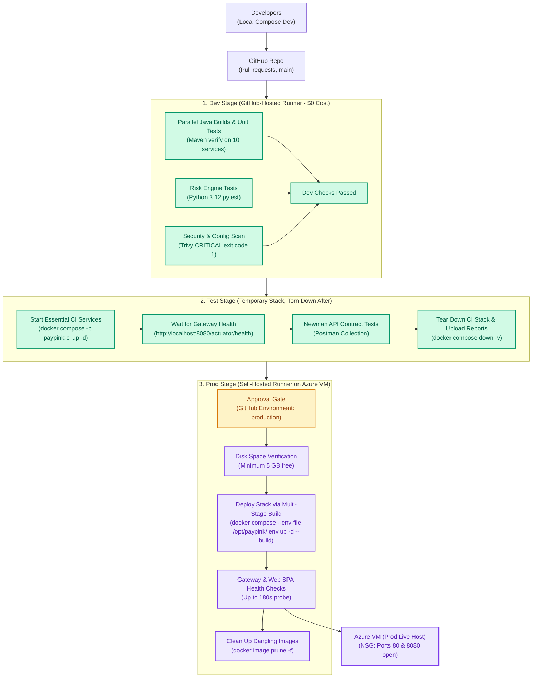

# PayPink 2.0 — Azure Cloud & CI/CD Deployment Guide
**Omnichannel Remittance, Real-Time Fraud Screening & Core Retail Ledger**

---

## 1. Cloud Architecture & Pipeline Stage Topology

### Infrastructure Topology
PayPink 2.0 is hosted on Microsoft Azure as a containerized microservice matrix running on an Ubuntu 24.04 LTS Virtual Machine (`Standard_D4s_v3`, 4 vCPU / 16GB RAM) orchestrated by Docker Compose.

```mermaid
flowchart TD
    subgraph Clients["Clients & Ingress"]
        Browser["Admin & Customer Web SPA\n(HTTP :80)"]
        Mobile["Flutter Mobile App\n(REST :8080)"]
        Devs["Engineering Team\n(SSH :22 Whitelisted)"]
    end

    subgraph AzureRG["Azure Resource Group (rg-azuser8406_mml.local-722QP)"]
        subgraph NSG["Network Security Group (NSG)"]
            FWRules["Inbound Rules:\n• Port 80 (HTTP / Nginx Web SPA)\n• Port 8080 (API Gateway)\n• Port 22 (SSH - Team IPs Whitelisted)\n• Azure Default Deny All Else"]
        end

        subgraph VM["Ubuntu 24.04 LTS VM (Standard_D4s_v3 - 4 vCPU / 16GB RAM)"]
            subgraph Edge["Edge Layer"]
                Nginx["Web SPA (Nginx :80)"]
                Gateway["API Gateway (Spring Cloud :8080)"]
            end

            subgraph CoreServices["Internal Microservices (ledger-net)"]
                Orchestrator["remittance-orchestrator (:8083)"]
                Risk["risk-engine (Python FastAPI :8000)"]
                T24["t24-adapter + mock-core (127.0.0.1:9089)"]
                Auth["auth-service (:8081)"]
                Account["account-service (:8082)"]
                Notif["notification-service (:8084)"]
                Audit["audit-service (:8085)"]
                Recon["reconciliation-service (:8086)"]
                Outbox["outbox-publisher (:8087)"]
                Analytics["analytics-service (:8088)"]
            end

            subgraph Datastores["Datastores & Streaming"]
                SQL["Azure SQL / MSSQL (Master OLTP :1433)"]
                Postgres["PostgreSQL 15 (Immutable Audit :5432)"]
                Redis["Redis 7 (Idempotency & Rate Limit :6379)"]
                Kafka["Apache Kafka + Zookeeper (:9092)"]
            end

            subgraph Telemetry["Observability Stack (Loopback)"]
                OTel["OpenTelemetry Collector (:4317/:4318)"]
                Prom["Prometheus (:9090)"]
                Loki["Loki (:3100)"]
                Tempo["Tempo (:3200)"]
                Grafana["Grafana (127.0.0.1:3000)"]
            end

            Runner["GitHub Self-Hosted Runner\n(Labels: self-hosted, azure-vm)"]
        end
    end

    Browser -->|HTTP :80| Nginx
    Nginx -->|Proxy /api/| Gateway
    Mobile -->|REST :8080| Gateway
    Devs -->|SSH :22 (Team IPs)| VM

    Gateway --> CoreServices
    CoreServices --> Datastores
    CoreServices -.->|OTLP Metrics/Traces| OTel
    OTel --> Prom
    OTel --> Loki
    OTel --> Tempo
    Prom --> Grafana
    Loki --> Grafana
    Tempo --> Grafana
```

---

## 2. CI/CD Pipeline Stages Architecture

PayPink 2.0 uses a 3-stage CI/CD pipeline. **Dev and Test stages use free GitHub cloud runners (zero Azure compute cost)**; deployments to the Azure VM only trigger on the `main` branch after approval.



---

## 3. Azure Budget Optimization ($10 Cloud Budget Strategy)

### Budget Reality & Calculations
* **Compute:** `Standard_D4s_v3` (4 vCPU, 16 GiB RAM) costs **~$0.192 per hour**.
* **Storage & Static IP:** A 64 GB Standard SSD and Standard Public IP incur background charges even when the VM is deallocated (**~$0.25 to $0.30 per day**).
* **Net Available Runtime:** Over a typical 9–10 day capstone sprint, static costs consume ~$2.50. The remaining ~$7.50 provides **~40 hours of active VM runtime**.

### Mandatory Cost Control Protocols:
1. **Always Deallocate when Inactive (Stopping inside Linux does NOT pause compute billing):**
   ```bash
   az vm deallocate --resource-group "rg-azuser8406_mml.local-722QP" --name "vm-paypink-aly"
   ```
2. **Auto-Shutdown Schedule (Every day at 7:00 PM PHT / 11:00 UTC):**
   Configured in `01-provision-azure.sh` or via Azure CLI:
   ```bash
   az vm auto-shutdown \
     --resource-group "rg-azuser8406_mml.local-722QP" \
     --name "vm-paypink-aly" \
     --time "1100"
   ```
3. **Configure DNS Label (Preserves FQDN across deallocations):**
   ```bash
   az network public-ip update \
     --resource-group "rg-azuser8406_mml.local-722QP" \
     --name "vm-paypink-alyPublicIP" \
     --dns-name "paypink-demo-ph"
   ```
   **FQDN Format:** `<DNS_LABEL>.<REGION>.cloudapp.azure.com` (e.g. `paypink-demo-ph.eastus.cloudapp.azure.com`).

---

## 4. Step-by-Step Deployment Walkthrough

### Step 1: Provision Azure Infrastructure via CLI
Run [`scripts/01-provision-azure.sh`](file:///scripts/01-provision-azure.sh) from your laptop or Cloud Shell after `az login`:

```bash
export RESOURCE_GROUP="rg-azuser8406_mml.local-722QP"
export DNS_LABEL="paypink-demo-ph"
export TEAM_IPS="203.0.113.10/32 198.51.100.7/32"   # Replace with teammates' public IPs (curl ifconfig.me)
export VM_NAME="vm-paypink-aly"

./scripts/01-provision-azure.sh
```

**Key Security Configurations Applied:**
* **SSH Port 22:** Whitelisted exclusively to `${TEAM_IPS}`.
* **HTTP Port 80 & API Gateway Port 8080:** Open for customer/mobile ingress.
* **All Other Ports:** Blocked by Azure's default `DenyAllInBound` rule.

---

### Step 2: Bootstrap the Ubuntu 24.04 VM Host
Copy [`scripts/02-bootstrap-vm.sh`](file:///scripts/02-bootstrap-vm.sh) to the VM and run as `azureuser` (non-root):

```bash
scp scripts/02-bootstrap-vm.sh azureuser@<VM_FQDN>:~
ssh azureuser@<VM_FQDN> "./02-bootstrap-vm.sh"
```

**What this script configures:**
1. **4 GB Swap Space:** Safety net for bursts.
2. **Memory Limit Tuning:** Creates `/opt/paypink/.env` with `MSSQL_MEMORY_LIMIT_MB=3072` and `JAVA_TOOL_OPTIONS=-XX:MaxRAMPercentage=60` so ~20 containers run smoothly within 16 GB RAM.
3. **Hardened Docker Daemon:** Enables log rotation (`max-size: 10m`, `max-file: 3`) to prevent disk exhaustion.
4. **Secure User Permissions:** Adds `azureuser` to the `docker` group (`usermod -aG docker $USER`). **Never `chmod 666 /var/run/docker.sock`**.

---

### Step 3: Install GitHub Self-Hosted Runner on VM
1. Go to your GitHub Repository $\rightarrow$ **Settings** $\rightarrow$ **Actions** $\rightarrow$ **Runners** $\rightarrow$ **New self-hosted runner** (Linux / x64).
2. Follow the download and configuration steps shown in the GitHub UI:
   ```bash
   mkdir -p ~/actions-runner && cd ~/actions-runner
   # Use the exact curl URL shown by GitHub
   tar xzf ./actions-runner-linux-x64-*.tar.gz

   # Register with runner labels
   ./config.sh --url https://github.com/TechStart-Integration-Capstone/Integrated-Capstone \
     --token <RUNNER_TOKEN_FROM_GITHUB> \
     --labels "self-hosted,azure-vm" --unattended

   # Install & start service
   sudo ./svc.sh install azureuser
   sudo ./svc.sh start
   ```
   > [!TIP]
   > If the runner was started before adding the user to the docker group, restart the service:
   > `sudo ./svc.sh stop && sudo ./svc.sh start`

---

### Step 4: Validate External Port Hardening (Chaos 3 Evidence)
Run [`scripts/03-verify-ports.sh`](file:///scripts/03-verify-ports.sh) from outside the VM:

```bash
./scripts/03-verify-ports.sh paypink-demo-ph.eastus.cloudapp.azure.com
```

**Expected Result:**
* Ports **80** and **8080** are `OPEN`.
* Port **22** is `OPEN` only if your IP is in the NSG whitelist.
* All internal ports (`1433`, `3000`, `5432`, `6379`, `8081-8090`, `9089`, `9092`) report `closed` or `filtered`.

---

## 5. Live Services & Verification URLs

| Component | Port & Scope | Target Access URL |
| :--- | :--- | :--- |
| **Web SPA (Nginx)** | `80` (Public) | `http://<VM_FQDN>` |
| **API Gateway Health** | `8080` (Public) | `http://<VM_FQDN>:8080/actuator/health` |
| **T24 Mock Core Sidecar** | `127.0.0.1:9089` (Loopback) | `http://127.0.0.1:9089` (Internal container network) |
| **Grafana Observability** | `127.0.0.1:3000` (Loopback) | `ssh -L 3000:localhost:3000 azureuser@<VM_FQDN>` $\rightarrow$ `http://localhost:3000` |

### Security & Seed Accounts
* Seed accounts configured in database scripts should load secure demo passwords from `/opt/paypink/.env`.
* Keep the deployment repository private to prevent leaking environment configurations and host addresses.
