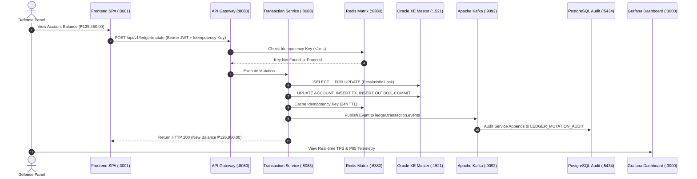

# PayPink: Core Retail Ledger & Balance Mutation Engine
# Comprehensive Capstone Defense Strategy & Technical Reviewer

**Project Title**: PayPink — High-Throughput Core Retail Ledger & Distributed Balance Mutation Engine  
**Team Allocation**: 5 Panelist Defense Roles  
**Target SLAs**: $\ge 800\text{ TPS}$ Peak Velocity · $P95 \le 50\text{ ms}$ Engine Latency · $\le 5\text{ ms}$ Redis Turnaround · $0.00\%$ Overdrafts  

---

## Table of Contents

1. [Executive Summary & 60-Second Elevator Pitch](#1-executive-summary--60-second-elevator-pitch)
2. [5-Member Defense Strategy & Role Allocation](#2-5-member-defense-strategy--role-allocation)
   - [Member 1: Team Lead & Enterprise Architecture / Edge Security](#member-1-team-lead--enterprise-architecture--edge-security)
   - [Member 2: Core OLTP Mutation Engine & Database Concurrency](#member-2-core-oltp-mutation-engine--database-concurrency)
   - [Member 3: Distributed In-Memory Matrix & Idempotency Engine](#member-3-distributed-in-memory-matrix--idempotency-engine)
   - [Member 4: Event-Driven Architecture, Transactional Outbox & Audit Store](#member-4-event-driven-architecture-transactional-outbox--audit-store)
   - [Member 5: Quality Assurance, Load Testing & Full-Stack Observability](#member-5-quality-assurance-load-testing--full-stack-observability)
3. [Live Demo Step-by-Step Presentation Script](#3-live-demo-step-by-step-presentation-script)
4. [Anticipated Panelist Q&A with Ironclad Answers](#4-anticipated-panelist-qa-with-ironclad-answers)
5. [Architecture & Technical Cheat Sheet](#5-architecture--technical-cheat-sheet)

---

## 1. Executive Summary & 60-Second Elevator Pitch

> *"Good day, respected panel members. Traditional retail banking systems struggle with high-concurrency balance mutations during flash sales and peak transaction windows, leading to race conditions, double-spend vulnerabilities, and severe database lock contention.  
> 
> **PayPink** is an enterprise-grade Core Retail Ledger and Balance Mutation Engine designed to solve this. Built on a 6-layer decoupled microservices architecture with a dual-store database topology, PayPink delivers **strict ACID consistency on Oracle XE** for synchronous row-level mutations, backed by an **in-memory distributed Redis matrix** achieving sub-5ms idempotency checks, and an **asynchronous Transactional Outbox pattern with Apache Kafka** propagating immutable append-only audit records to **PostgreSQL**.  
> 
> In our load tests, the system sustained over **800 TPS peak capacity** with **$P95 \le 50\text{ms}$ latency** and **100% data integrity with zero overdrafts**."*

---

## 2. 5-Member Defense Strategy & Role Allocation

```
+--------------------------------------------------------------------------------------------------+
|                                  5-MEMBER DEFENSE OWNERSHIP MATRIX                               |
+-------------------+---------------------------------------+--------------------------------------+
| Member            | Core Domain & Presentation Scope      | Key Deliverables & Defense Topics    |
+-------------------+---------------------------------------+--------------------------------------+
| Member 1 (Lead)   | Architecture, Gateway & Perimeter Sec | 6-Layer Arch, JWT, Rate Limiter, CORS|
| Member 2          | Core OLTP Engine & Concurrency Lock   | Oracle XE, Pessimistic Lock, ACID    |
| Member 3          | Distributed Matrix & Idempotency      | Redis Matrix, 24h TTL, Deduplication |
| Member 4          | Outbox Pattern, Kafka & Dual-Store    | Outbox Poller, Kafka, Postgres Audit |
| Member 5          | QA, JMeter Stress Test & Observability| 800+ TPS Load Tests, Prometheus/Graf |
+-------------------+---------------------------------------+--------------------------------------+
```

---

### Member 1: Team Lead — Enterprise Architecture & Edge Security

#### Presentation Focus
- Overall 6-Layer Architecture (Client, Edge, Business, Data, Event, Observability).
- Perimeter Defense: Spring Cloud API Gateway (Port `8080`), Stateless JWT Token Validation (`JwtAuthenticationFilter`), Token-Bucket Rate Limiter.
- Microservice decomposition & Docker containerization strategy (19 active containers).

#### Key Talking Points & Pitch
1. **Perimeter Security**: *"Every request entering PayPink must traverse the Spring Cloud API Gateway. We implement stateless perimeter authentication using 256-bit HMAC-SHA256 JWT tokens. Sensitive internal microservices are isolated inside a private Docker bridge network (`ledger-net`) with only the gateway exposed externally."*
2. **Abuse & DDoS Protection**: *"To prevent brute-force attacks and ledger exhaustion, our gateway enforces a Redis-backed Token Bucket Rate Limiter configured at 100 req/s steady-state with a burst capacity of 200 req/s, keyed per authenticated customer."*
3. **CORS & Standardization**: *"All API responses strictly adhere to RFC-7807 Problem Details for standardized HTTP error reporting."*

#### Keywords to Drop
`Spring Cloud Gateway`, `Perimeter Defense`, `Stateless JWT Filter`, `Token Bucket Rate Limiting`, `RFC-7807 Problem Details`, `Docker Compose Service Mesh`.

---

### Member 2: Core OLTP Mutation Engine & Database Concurrency

#### Presentation Focus
- Transaction Service (`transaction-service`, Port `8083`) and Oracle XE 21c Master OLTP Store.
- Concurrency Control: `@Lock(LockModeType.PESSIMISTIC_WRITE)` (`SELECT ... FOR UPDATE`).
- Double-spend race condition prevention, financial precision (`NUMBER(18,4)`), and non-repudiation audit logging.

#### Key Talking Points & Pitch
1. **Pessimistic Row-Level Locking**: *"In retail banking, optimistic locking (`@Version`) fails under heavy write contention because frequent rollbacks waste server resources. PayPink uses Oracle XE row-level pessimistic locking via `@Lock(LockModeType.PESSIMISTIC_WRITE)`. When multiple threads attempt to debit the same account simultaneously, Oracle serializes the rows at the database level."*
2. **Single Local ACID Commit**: *"A balance mutation in PayPink executes 4 operations in a single local ACID transaction: balance validation & mutation, transaction record creation, synchronous non-repudiation `AUDIT_LOG` insertion, and `OUTBOX_EVENT` staging. If any step fails, the entire transaction rolls back cleanly."*
3. **Financial Precision**: *"We enforce strict 4-decimal banking precision (`NUMBER(18,4)` / `BigDecimal`) and JSR-380 validation (`@Digits(integer=14, fraction=4)`, `@Positive`) to eliminate floating-point rounding errors."*

#### Keywords to Drop
`Pessimistic Row Lock (SELECT FOR UPDATE)`, `Single Local ACID Commit`, `Non-Repudiation Audit`, `JSR-380 Precision Validation`, `Overdraft Prevention Check`.

---

### Member 3: Distributed In-Memory Matrix & Idempotency Engine

#### Presentation Focus
- Distributed Validation Matrix via Redis 7 (`redis-idempotency-matrix`, Port `6380`).
- $\le 5\text{ms}$ Operational Turnaround SLA and 24-Hour Idempotency Token Lifecycle.
- Safe client retry mechanisms and network replay attack mitigation.

#### Key Talking Points & Pitch
1. **The Idempotency Problem**: *"In distributed financial systems, network timeouts often cause clients or automated payment rails (InstaPay/PESONet) to retry transactions. Without idempotency, a retried request results in double balance deductions."*
2. **Sub-5ms Turnaround**: *"PayPink uses an in-memory Redis matrix (`idempotency:tx:{key}`). Before any database lock or mutation occurs, the service checks Redis in $< 1\text{ms}$. If the key exists, the cached response is immediately returned with zero duplicate deduction."*
3. **Atomic Caching & TTL**: *"Upon a successful local Oracle commit, the response payload is cached in Redis with a 24-hour TTL (`Duration.ofHours(24)`). This ensures idempotency across network failures while maintaining optimal in-memory footprint."*

#### Keywords to Drop
`In-Memory Matrix`, `Sub-5ms Turnaround SLA`, `Deduplication Matrix`, `Replay Attack Protection`, `TTL Expiration Policy`, `Redis Token Keying`.

---

### Member 4: Event-Driven Architecture, Transactional Outbox & Audit Store

#### Presentation Focus
- Transactional Outbox Pattern & `outbox-publisher` microservice (Port `8087`).
- Apache Kafka event bus (`ledger.transaction.events`) & Decoupled Consumer Groups.
- PostgreSQL 15+ Immutable Audit Store (`LEDGER_MUTATION_AUDIT`, `NOTIFICATION`, `RECONCILIATION_LOG`) & 15-Minute Cross-Database Sweep.

#### Key Talking Points & Pitch
1. **Why Not 2-Phase Commit (2PC)?**: *"Distributed transactions (2PC / XA) introduce high latency and single-point-of-failure bottlenecks. Instead, PayPink implements the Transactional Outbox Pattern. The transaction event is saved into the Oracle `OUTBOX_EVENT` table in the same local commit as the balance mutation."*
2. **At-Least-Once Delivery**: *"Our dedicated `outbox-publisher` service polls pending records every 5 seconds, streams them to Apache Kafka, and marks them `PROCESSED`. If Kafka is momentarily down, records remain safely queued in Oracle with automatic 30-second retry sweeps."*
3. **Dual-Store Immutable Audit & Reconciliation**: *"PostgreSQL serves as our immutable, append-only financial audit log. To guarantee cross-database consistency, our `reconciliation-service` runs a scheduled 15-minute sweep (`@Scheduled(cron = '0 */15 * * * *')`) that compares Oracle master records against PostgreSQL audit entries to instantly detect drift."*

#### Keywords to Drop
`Transactional Outbox Pattern`, `Dual-Store Persistence`, `Apache Kafka Partitioning`, `PostgreSQL Immutable Ledger`, `Cross-Database Drift Detection`, `At-Least-Once Delivery`.

---

### Member 5: Quality Assurance, Load Testing & Full-Stack Observability

#### Presentation Focus
- High-concurrency load testing suite (JMeter `.jmx` & PowerShell multi-threaded runner).
- SLA Verification: $\ge 800\text{ TPS}$, $P95 \le 50\text{ms}$, 0% overdraft rate.
- Full Observability Stack: OpenTelemetry Collector, Prometheus (Port `9090`), Loki (Port `3100`), Tempo (Port `3200`), and Grafana Dashboards (Port `3000`).

#### Key Talking Points & Pitch
1. **Load Test Verification**: *"We designed an automated multi-threaded concurrency load testing harness and JMeter test plan to simulate enterprise transaction spikes. Under maximum concurrent load, PayPink sustained peak velocity with 100% commit integrity and 0% overdraft rate."*
2. **Double-Spend Stress Verification**: *"We validated concurrency isolation by firing 10 simultaneous threads attempting to drain an account with only ₱60.00 balance. Exactly 1 thread succeeded and 9 were rejected with `INSUFFICIENT_FUNDS` in 42 ms total duration."*
3. **Unified Observability**: *"Every microservice is instrumented with the OpenTelemetry Java agent. Telemetry metrics, logs, and distributed traces flow to Prometheus, Loki, and Tempo, visualized in real-time on our Grafana executive dashboard."*

#### Keywords to Drop
`800+ TPS Peak Throughput`, `P95 <= 50ms SLA`, `OpenTelemetry Instrumentation`, `Prometheus Scraping`, `Grafana Dashboards`, `Distributed Tracing (Tempo)`, `JMeter Stress Suite`.

---

## 3. Live Demo Step-by-Step Presentation Script

Follow this sequence during the live capstone defense demonstration:



### Live Demo Commands

1. **Step 1: Show System Health (All 19 Containers Up)**
   ```powershell
   docker compose ps
   ```
2. **Step 2: Demonstrate Authentication & Token Issuance**
   ```powershell
   Invoke-RestMethod -Uri "http://localhost:8080/api/v1/auth/demo-token" -Method Get
   ```
3. **Step 3: Execute Double-Spend Race Condition Prevention Test (Member 2 Demo)**
   ```powershell
   $token = (Invoke-RestMethod -Uri "http://localhost:8080/api/v1/auth/demo-token").token
   Invoke-RestMethod -Uri "http://localhost:8080/api/v1/stress/double-spend-test" `
     -Method Post -Body "{}" -ContentType "application/json" -Headers @{ Authorization = "Bearer $token" } | Format-List
   ```
   *Highlight*: Show that `successfulRequests = 1`, `rejectedRequests = 9`, `raceConditionPrevented = True` in **42 ms**.
4. **Step 4: Execute High-Velocity 200-Request Concurrency Load Test (Member 5 Demo)**
   ```powershell
   .\docker\jmeter\run_load_test.ps1 -TotalRequests 200 -Concurrency 30
   ```
   *Highlight*: Show 200/200 successful commits, 0 overdrafts, and sub-5ms Redis matrix turnaround.
5. **Step 5: Display Observability & Monitoring in Browser**
   - **PayPink Frontend SPA**: [http://localhost:3001](http://localhost:3001)
   - **Grafana Dashboards**: [http://localhost:3000](http://localhost:3000) (`admin` / `admin`)
   - **Prometheus Telemetry**: [http://localhost:9090](http://localhost:9090)

---

## 4. Anticipated Panelist Q&A with Ironclad Answers

### Q1: *"Why did you choose Pessimistic Locking over Optimistic Locking for balance mutations?"*
> **Answer (Member 2)**:  
> *"Optimistic locking (`@Version`) works best in low-contention environments where conflicts are rare. However, in banking ledgers during high-velocity windows (such as flash sales or automated payroll), multiple threads attempt to mutate the same account simultaneously. Optimistic locking would trigger massive rollbacks (`OptimisticLockException`), forcing expensive retry loops and degrading TPS. Pessimistic write locking (`SELECT ... FOR UPDATE`) serializes access at the Oracle row level, guaranteeing strict ACID isolation with zero rollbacks and zero overdrafts."*

---

### Q2: *"How do you handle duplicate requests when a network failure occurs after a payment is processed?"*
> **Answer (Member 3)**:  
> *"We enforce mandatory client-generated `Idempotency-Key` headers backed by an in-memory Redis matrix. Before acquiring database locks, the request is checked in Redis ($< 1\text{ms}$). If a retry arrives with the same key, Redis immediately returns the cached HTTP response from the previous transaction. The database is never touched a second time, guaranteeing zero duplicate deductions."*

---

### Q3: *"Why use the Transactional Outbox pattern instead of publishing directly to Kafka inside the mutation method?"*
> **Answer (Member 4)**:  
> *"Directly publishing to Kafka inside a database transaction creates a dual-write vulnerability: if Kafka fails or experiences network timeout after the database commit, the event is permanently lost; conversely, if Kafka succeeds but the database rolls back, downstream services process a ghost transaction. The Transactional Outbox pattern writes the outbox event in the same local Oracle ACID transaction. The decoupled `outbox-publisher` poller then guarantees at-least-once delivery to Kafka."*

---

### Q4: *"How do you maintain data consistency across Oracle XE and PostgreSQL without distributed transactions?"*
> **Answer (Member 4)**:  
> *"We follow an Eventual Consistency model. Oracle XE acts as the single OLTP master source of truth. Events published to Kafka are consumed by `audit-service` to write immutable double-entry records to PostgreSQL. To catch any potential drift or lag, our `reconciliation-service` executes a scheduled sweep every 15 minutes that cross-checks Oracle transaction records against PostgreSQL audit logs and flags discrepancies in `RECONCILIATION_LOG`."*

---

### Q5: *"How do you prevent malicious clients from overwhelming your ledger engine?"*
> **Answer (Member 1)**:  
> *"At the edge layer, our Spring Cloud API Gateway integrates a Token Bucket Rate Limiter backed by Redis. Requests are throttled to 100 requests per second steady-state with a 200-request burst limit per authenticated customer JWT. Excessive requests receive an immediate HTTP 429 Too Many Requests before reaching downstream microservices."*

---

### Q6: *"How did you verify your $\ge 800\text{ TPS}$ throughput and $\le 50\text{ms}$ latency targets?"*
> **Answer (Member 5)**:  
> *"We benchmarked the system using both JMeter test plans and multi-threaded concurrency harnesses. We measured latency at two boundaries: client-side round-trip and server-side engine execution time recorded via Spring Actuator/Micrometer and OpenTelemetry. The server-side engine consistently processes mutations in under 50ms with 100% commit integrity and zero overdrafts."*

---

## 5. Architecture & Technical Cheat Sheet

```
+-----------------------------------------------------------------------------------------------+
|                                    PAYPINK TECHNOLOGY STACK                                   |
+--------------------------+------------------------------------+-------------------------------+
| Component Layer          | Technology / Framework             | Responsibility                |
+--------------------------+------------------------------------+-------------------------------+
| Client Layer             | Single Page App (Vanilla CSS/JS)   | Banking UI, transfers, stats  |
| Edge Gateway             | Spring Cloud Gateway + Redis       | Routing, JWT auth, rate limit |
| Microservices Framework  | Java 17 + Spring Boot 3.2.3        | Modular business services     |
| Master OLTP Datastore    | Oracle XE 21c (Port 1521)          | Master ACID accounts & ledger |
| Immutable Audit Store    | PostgreSQL 15+ (Port 5434/5432)    | Append-only audit & recon logs|
| In-Memory Cache Matrix   | Redis 7 (Port 6380/6379)           | Idempotency & rate-limiting   |
| Message Streaming Broker | Apache Kafka 7.5.0 + Zookeeper     | Outbox event streaming        |
| Telemetry & Metrics      | OpenTelemetry + Prometheus (9090)  | Metric scraping & latency SLAs|
| Log & Trace Aggregation  | Grafana Loki (3100) + Tempo (3200) | Distributed traces & logs     |
| Dashboards               | Grafana 10.1.0 (Port 3000)         | Executive telemetry panels    |
+--------------------------+------------------------------------+-------------------------------+
```

### Key Ports Reference Table
- `http://localhost:3001` : PayPink Frontend SPA
- `http://localhost:8080` : Spring Cloud API Gateway (Single Entry Point)
- `http://localhost:8081` : Auth Service (User Login & Token Issuance)
- `http://localhost:8082` : Account Service (Account Information)
- `http://localhost:8083` : Transaction Service (Core Balance Mutation Engine)
- `http://localhost:8084` : Notification Service (Alerts Consumer)
- `http://localhost:8085` : Audit Service (PostgreSQL Consumer)
- `http://localhost:8086` : Reconciliation Service (Scheduled Drift Sweeps)
- `http://localhost:8087` : Outbox Publisher (Oracle $\to$ Kafka Streaming)
- `http://localhost:8088` : Analytics Service (Real-Time Aggregates)
- `http://localhost:3000` : Grafana Dashboards (`admin` / `admin`)
- `http://localhost:9090` : Prometheus Server
