# PayPink 2.0 — Unified Entity Relationship Diagram (ERD) & Data Dictionary

This document provides the canonical data architecture specification for **PayPink 2.0**, covering both datastores:
1. **Azure SQL (OLTP):** High-throughput, ACID-compliant core banking ledger and transactional state machine.
2. **PostgreSQL (Immutable Audit & Event Store):** Append-only compliance audit trail, automated reconciliation logs, fraud scoring decisions, and customer notifications.

---

## 1. Dual-Datastore Architecture Overview

PayPink 2.0 implements a **Polyglot Persistence & Transactional Outbox** architecture designed to guarantee strict financial consistency while meeting banking regulatory requirements for non-repudiation and auditability:

```
+──────────────────────────────────────────────────────────────────────────────────────────+
|                                    AZURE SQL (OLTP)                                      |
|  - Customer Profiles & Auth Credentials        - Two-Phase Balance Holds                 |
|  - Core Banking Accounts & Ledgers             - Saga Orchestration (Remittance)         |
|  - End-to-End Loan Lifecycles                  - Transactional Outbox Events             |
+──────────────────────────────────────────────────────────────────────────────────────────+
                                              │
                                              ▼ (Transactional Outbox Poller / CDC)
                             ┌─────────────────────────────────┐
                             │    Apache Kafka Event Bus       │
                             │  (transaction.events, loan.*)   │
                             └─────────────────────────────────┘
                                              │
                      ┌───────────────────────┼───────────────────────┐
                      ▼                       ▼                       ▼
           [ audit-service ]      [ reconciliation-service ]  [ notification-service ]
                      │                       │                       │
+─────────────────────┴───────────────────────┴───────────────────────┴────────────────────+
|                                 POSTGRESQL 15 (AUDIT STORE)                              |
|  - Immutable Debit/Credit Ledger Audit        - Automated Ledger Drift Detection         |
|  - Real-time Multi-Layer Fraud Decisions      - Multi-Channel Customer Notification Log  |
+──────────────────────────────────────────────────────────────────────────────────────────+
```

### Key Architectural Boundaries
- **Physical Foreign Keys (Solid Lines):** Strictly enforced within Azure SQL to guarantee relational integrity across customer, account, ledger, remittance, and loan tables.
- **Logical References (Dotted Lines):** Decoupled across database boundaries. Azure SQL and PostgreSQL never share distributed 2-phase commit (2PC) transactions. Instead, events are captured transactionally via `OUTBOX_EVENT` and published to Kafka topics, ensuring asynchronous eventual consistency and non-blocking OLTP throughput.

---

## 2. Unified Entity Relationship Diagram

```mermaid
erDiagram
    %% =========================================================================
    %% 1. AZURE SQL (OLTP Core Banking Database)
    %% =========================================================================

    CUSTOMER {
        bigint customer_id PK "Identity(1,1)"
        nvarchar username UK "max 50, Unique"
        nvarchar password_hash "max 255, BCrypt"
        nvarchar first_name "max 100"
        nvarchar last_name "max 100"
        nvarchar email UK "max 150, Unique"
        nvarchar contact_no "max 30"
        nvarchar status "max 20, default ACTIVE"
        datetime2 created_date "UTC timestamp"
        int credit_score "default 650, CHECK 300..850"
        decimal monthly_income "18,4 - default 30000.0000"
        decimal daily_transfer_limit "18,4 - default 50000.0000"
        decimal per_tx_limit "18,4 - default 25000.0000"
    }

    ACCOUNT {
        bigint account_id PK "Identity(1,1)"
        bigint customer_id FK "References CUSTOMER(customer_id)"
        nvarchar account_number UK "max 30, Unique"
        nvarchar account_type "max 30, default SAVINGS"
        nvarchar currency "max 10, default PHP"
        decimal current_balance "18,4 - CHECK >= 0"
        decimal held_balance "18,4 - CHECK 0 <= held <= current"
        decimal interest_rate "7,4 - annual fraction for LOAN; default 0"
        nvarchar status "max 20, default ACTIVE"
        datetime2 created_date "UTC timestamp"
    }

    EOD_JOB_RUN {
        bigint job_run_id PK
        date business_date UK "With job_name"
        nvarchar job_name UK
        nvarchar status "RUNNING or SUCCESS"
        datetime2 started_at
        datetime2 ended_at
    }

    GL_ENTRY {
        bigint gl_entry_id PK
        bigint account_id FK
        decimal amount "18,2"
        nvarchar entry_type "CREDIT or DEBIT"
        nvarchar posting_type "MONTHLY_INTEREST"
        nvarchar description
        date business_date
        date period_start
        date period_end "Unique with account_id and posting_type"
        bigint job_run_id FK
        bigint transaction_id FK "Nullable for zero interest"
        datetime2 created_at
    }

    INTEREST_ACCRUAL {
        bigint accrual_id PK
        bigint account_id "Logical Azure SQL reference"
        date business_date "Unique with account_id"
        numeric eod_balance "18,4"
        numeric rate "7,4 - annual fraction"
        numeric interest_amount "18,6"
        timestamptz created_at
    }

    INTEREST_ACCRUAL_BATCH {
        date business_date PK
        int account_count
        timestamptz created_at
    }

    AUDIT_LOG {
        bigint audit_id PK "Identity(1,1)"
        bigint customer_id FK "References CUSTOMER(customer_id)"
        nvarchar action "max 100"
        nvarchar entity "max 50"
        nvarchar details "max 4000"
        datetime2 timestamp "UTC timestamp"
    }

    BANKING_FAVORITE {
        bigint favorite_id PK "Identity(1,1)"
        bigint customer_id FK "References CUSTOMER(customer_id)"
        bigint account_id FK "References ACCOUNT(account_id)"
        datetime2 created_date "UTC timestamp"
    }

    LEDGER_TRANSACTION {
        bigint transaction_id PK "Identity(1,1)"
        bigint from_account_id FK "References ACCOUNT(account_id)"
        bigint to_account_id FK "References ACCOUNT(account_id), Nullable"
        decimal amount "18,4 - CHECK > 0"
        nvarchar source_currency "max 10"
        nvarchar target_currency "max 10"
        nvarchar transaction_type "max 30"
        nvarchar reference_no UK "max 64, Unique"
        nvarchar status "max 20"
        nvarchar failure_reason "max 255, Nullable"
        datetime2 transaction_date "UTC timestamp"
    }

    OUTBOX_EVENT {
        bigint event_id PK "Identity(1,1)"
        bigint transaction_id FK "References LEDGER_TRANSACTION(transaction_id), Nullable"
        nvarchar aggregate_id "max 40, Nullable (e.g. LN-..., LAP-...)"
        nvarchar event_type "max 50"
        nvarchar payload "NVARCHAR(MAX) JSON"
        nvarchar status "max 20, default PENDING"
        datetime2 created_date "UTC timestamp"
        datetime2 processed_date "UTC timestamp, Nullable"
    }

    REMITTANCE {
        bigint remittance_id PK "Identity(1,1)"
        nvarchar reference_no UK "max 64, Unique"
        bigint caller_customer_id "UK(caller_customer_id, idempotency_key)"
        nvarchar idempotency_key "max 80, Nullable"
        bigint source_account_id FK "References ACCOUNT(account_id)"
        bigint target_account_id FK "References ACCOUNT(account_id)"
        decimal amount "18,4 - CHECK > 0"
        nvarchar currency "max 10, default PHP"
        nvarchar status "max 30 (Initiated, Authorized, Reserved, Processing, Posted, Failed, Cancelled)"
        nvarchar internal_status "max 40, Nullable (11-step pipeline + reversal lifecycle)"
        nvarchar current_service "max 40, Nullable"
        nvarchar transaction_type "max 30, default TRANSFER"
        decimal risk_score "5,4 - Nullable (0.0000 - 1.0000)"
        nvarchar risk_decision "max 20, Nullable (APPROVE, REJECT)"
        nvarchar ft_reference "max 64, Nullable (T24 FT Reference)"
        nvarchar reason "max 255, Nullable"
        datetime2 created_at "UTC timestamp"
        datetime2 updated_at "UTC timestamp"
        datetime2 cancel_until "UTC timestamp, Nullable (30s window)"
        int retry_count "default 0"
        int max_retries "default 3"
        datetime2 next_retry_at "UTC timestamp, Nullable"
    }

    LOAN_APPLICATION {
        bigint application_id PK "Identity(1,1)"
        nvarchar reference_no UK "max 30, LAP-yyyyMMdd-nnnnnn"
        nvarchar idempotency_key UK "max 64, Unique"
        bigint customer_id FK "References CUSTOMER(customer_id)"
        bigint account_id FK "References ACCOUNT(account_id)"
        decimal requested_amount "18,4"
        int requested_term "Term in months"
        int credit_score "Captured credit score"
        nvarchar decision "max 15 (APPROVED, COUNTER_OFFER, DECLINED)"
        decimal offered_amount "18,4 - Nullable"
        int offered_term "Nullable"
        decimal annual_rate "6,3 - Nullable"
        decimal monthly_installment "18,4 - Nullable"
        nvarchar decline_reason "max 50, Nullable"
        nvarchar status "max 15 (DECIDED, DISBURSING, ACCEPTED, FAILED, EXPIRED)"
        datetime2 expires_at "UTC timestamp (7-day offer window)"
        datetime2 created_date "UTC timestamp"
    }

    LOAN {
        bigint loan_id PK "Identity(1,1)"
        nvarchar reference_no UK "max 30, LN-yyyyMMdd-nnnnnn"
        bigint application_id FK "References LOAN_APPLICATION(application_id), Unique"
        bigint customer_id FK "References CUSTOMER(customer_id)"
        bigint account_id FK "References ACCOUNT(account_id)"
        decimal principal "18,4"
        decimal annual_rate "6,3"
        int term_months "Duration in months"
        decimal monthly_installment "18,4"
        decimal outstanding_principal "18,4 - CHECK >= 0"
        decimal penalty_due "18,4 - default 0.0000"
        nvarchar status "max 10 (ACTIVE, OVERDUE, CLOSED)"
        bigint disbursement_txn_id FK "References LEDGER_TRANSACTION(transaction_id), Nullable"
        nvarchar ft_reference "max 20, Nullable"
        date disbursed_date "Disbursement calendar date"
        date maturity_date "Maturity calendar date"
    }

    LOAN_SCHEDULE {
        bigint schedule_id PK "Identity(1,1)"
        bigint loan_id FK "References LOAN(loan_id), UK(loan_id, installment_no)"
        int installment_no "Installment sequence number"
        date due_date "Payment due date"
        decimal principal_due "18,4"
        decimal interest_due "18,4"
        decimal amount_paid "18,4 - default 0.0000"
        bit penalty_charged "default 0 (One-time EOD penalty)"
        nvarchar status "max 10 (PENDING, PAID, OVERDUE)"
    }

    LOAN_REPAYMENT {
        bigint repayment_id PK "Identity(1,1)"
        bigint loan_id FK "References LOAN(loan_id)"
        nvarchar reference_no UK "max 30, LRP-yyyyMMdd-nnnnnn"
        nvarchar idempotency_key UK "max 64, Unique"
        decimal amount "18,4 - CHECK > 0"
        bigint transaction_id FK "References LEDGER_TRANSACTION(transaction_id), Nullable"
        datetime2 created_date "UTC timestamp"
    }

    %% =========================================================================
    %% 2. POSTGRESQL (Immutable Audit & Event Datastore)
    %% =========================================================================

    LEDGER_MUTATION_AUDIT {
        bigserial audit_id PK "Primary Key"
        bigint transaction_id "UK(transaction_id, account_id)"
        bigint account_id "Account affected"
        varchar entry_type "max 10, CHECK IN ('DEBIT', 'CREDIT')"
        numeric amount "18,4 - CHECK > 0"
        varchar currency "max 10"
        numeric before_balance "18,4"
        numeric after_balance "18,4"
        timestamptz created_date "Audit commit timestamp with TZ"
    }

    RECONCILIATION_LOG {
        bigserial recon_id PK "Primary Key"
        bigint transaction_id "UK(transaction_id, account_id)"
        bigint account_id "Account reconciled"
        varchar oracle_status "max 30 (Status in OLTP Azure SQL)"
        varchar postgres_status "max 30 (Status in Audit Postgres)"
        varchar recon_status "max 30 (MATCHED, DRIFT_DETECTED)"
        varchar mismatch_fields "max 200, Nullable"
        int check_count "Number of verification passes"
        timestamptz last_checked_at "Last verification timestamp"
        timestamptz recon_date "Initial check timestamp"
    }

    NOTIFICATION {
        bigserial notification_id PK "Primary Key"
        bigint customer_id "Recipient customer"
        bigint account_id "UK(reference_no, account_id)"
        varchar reference_no "max 64, Transaction or Loan Ref"
        text message "Notification text payload"
        varchar status "max 20, CHECK IN ('PENDING', 'SENT', 'FAILED', 'RETRY')"
        timestamptz created_date "Creation timestamp"
        timestamptz updated_date "Dispatch timestamp, Nullable"
    }

    RISK_DECISION {
        bigserial decision_id PK "Primary Key"
        varchar reference_no "max 64 (Remittance Reference)"
        numeric score "5,4 - Combined Risk Score [0.0000 - 1.0000]"
        numeric rule_score "5,4 - Layer 1 Deterministic Rules, Nullable"
        numeric ml_score "5,4 - Layer 2 Isolation Forest, Nullable"
        varchar decision "max 20 (APPROVE, REJECT, UNAVAILABLE)"
        jsonb reasons "JSON array of triggered risk indicators"
        int latency_ms "Execution duration in milliseconds"
        timestamptz scored_at "Scoring event timestamp"
    }

    %% =========================================================================
    %% 3. PHYSICAL FOREIGN KEY RELATIONSHIPS (Azure SQL)
    %% =========================================================================

    CUSTOMER ||--o{ ACCOUNT : "owns (customer_id)"
    CUSTOMER ||--o{ AUDIT_LOG : "audited (customer_id)"
    CUSTOMER ||--o{ BANKING_FAVORITE : "saves (customer_id)"
    ACCOUNT ||--o{ BANKING_FAVORITE : "bookmarked as (account_id)"
    ACCOUNT ||--o{ GL_ENTRY : "posted interest"
    EOD_JOB_RUN ||--o{ GL_ENTRY : "posting job"
    LEDGER_TRANSACTION |o--o| GL_ENTRY : "interest credit"
    ACCOUNT ||..o{ INTEREST_ACCRUAL : "daily EOD snapshot"
    INTEREST_ACCRUAL_BATCH ||..o{ INTEREST_ACCRUAL : "completed business date"
    ACCOUNT ||--o{ LEDGER_TRANSACTION : "debited from (from_account_id)"
    ACCOUNT |o--o{ LEDGER_TRANSACTION : "credited to (to_account_id)"
    LEDGER_TRANSACTION ||--o{ OUTBOX_EVENT : "publishes (transaction_id)"
    ACCOUNT ||--o{ REMITTANCE : "source funds (source_account_id)"
    ACCOUNT ||--o{ REMITTANCE : "target funds (target_account_id)"
    CUSTOMER ||--o{ LOAN_APPLICATION : "applies (customer_id)"
    ACCOUNT ||--o{ LOAN_APPLICATION : "designated for (account_id)"
    LOAN_APPLICATION ||--o| LOAN : "originates (application_id)"
    CUSTOMER ||--o{ LOAN : "borrower (customer_id)"
    ACCOUNT ||--o{ LOAN : "disbursement destination (account_id)"
    LOAN ||--|{ LOAN_SCHEDULE : "amortized schedule (loan_id)"
    LOAN ||--o{ LOAN_REPAYMENT : "repaid by (loan_id)"
    LEDGER_TRANSACTION |o--o| LOAN : "disbursement entry (disbursement_txn_id)"
    LEDGER_TRANSACTION |o--o| LOAN_REPAYMENT : "ledger settlement (transaction_id)"

    %% =========================================================================
    %% 4. LOGICAL CROSS-DATASTORE REFERENCES (Decoupled via Apache Kafka)
    %% =========================================================================

    CUSTOMER ||..o{ REMITTANCE : "initiates (caller_customer_id, application check)"
    LEDGER_TRANSACTION ||..o{ LEDGER_MUTATION_AUDIT : "streamed via Kafka (transaction_id)"
    ACCOUNT ||..o{ LEDGER_MUTATION_AUDIT : "balance trail (account_id)"
    LEDGER_TRANSACTION ||..o{ RECONCILIATION_LOG : "integrity checked (transaction_id)"
    ACCOUNT ||..o{ RECONCILIATION_LOG : "reconciles balance (account_id)"
    LEDGER_TRANSACTION ||..o{ NOTIFICATION : "transaction ref (reference_no)"
    CUSTOMER ||..o{ NOTIFICATION : "alert delivered to (customer_id)"
    ACCOUNT ||..o{ NOTIFICATION : "account alert (account_id)"
    REMITTANCE ||..o{ RISK_DECISION : "scored by fraud engine (reference_no)"
```



---

## 3. Azure SQL (OLTP) Data Dictionary

### 3.1 `CUSTOMER`
Represents registered banking users, authentication credentials, transfer limits, and credit profile metrics.

| Column | Type | Nullable | Default / Constraint | Description |
|---|---|---|---|---|
| `customer_id` | `BIGINT` | `NO` | `IDENTITY(1,1)`, `PK` | Unique internal customer identifier. |
| `username` | `NVARCHAR(50)` | `NO` | `UNIQUE` | Unique login username. |
| `password_hash` | `NVARCHAR(255)` | `NO` | — | BCrypt password hash. |
| `first_name` | `NVARCHAR(100)` | `NO` | — | Customer legal first name. |
| `last_name` | `NVARCHAR(100)` | `NO` | — | Customer legal last name. |
| `email` | `NVARCHAR(150)` | `NO` | `UNIQUE` | Unique contact and notification email address. |
| `contact_no` | `NVARCHAR(30)` | `NO` | — | Customer mobile/contact number. |
| `status` | `NVARCHAR(20)` | `NO` | `'ACTIVE'` | Account status (`ACTIVE`, `SUSPENDED`, `LOCKED`). |
| `created_date` | `DATETIME2` | `NO` | `GETUTCDATE()` | Customer registration timestamp. |
| `credit_score` | `INT` | `NO` | `650`, `CHECK (300..850)` | Automated credit score for instant loan scoring. |
| `monthly_income` | `DECIMAL(18,4)` | `NO` | `30000.0000` | Declared monthly income in PHP for DTI checks. |
| `daily_transfer_limit` | `DECIMAL(18,4)` | `NO` | `50000.0000` | 24-hour cumulative outbound transfer cap. |
| `per_tx_limit` | `DECIMAL(18,4)` | `NO` | `25000.0000` | Single-transaction transfer velocity cap. |

---

### 3.2 `ACCOUNT`
Represents bank deposit and internal settlement accounts. Implements two-phase balance locking via `held_balance`.

| Column | Type | Nullable | Default / Constraint | Description |
|---|---|---|---|---|
| `account_id` | `BIGINT` | `NO` | `IDENTITY(1,1)`, `PK` | Unique internal account identifier. |
| `customer_id` | `BIGINT` | `NO` | `FK -> CUSTOMER(customer_id)` | Owning customer. |
| `account_number` | `NVARCHAR(30)` | `NO` | `UNIQUE` | Formatted account number (e.g., `PH...`). |
| `account_type` | `NVARCHAR(30)` | `NO` | `'SAVINGS'` | Type (`SAVINGS`, `CHECKING`, `INTERNAL`). |
| `currency` | `NVARCHAR(10)` | `NO` | `'PHP'` | ISO 4217 currency code. |
| `current_balance` | `DECIMAL(18,4)` | `NO` | `CHECK (current_balance >= 0)` | Total posted account funds. |
| `held_balance` | `DECIMAL(18,4)` | `NO` | `CHECK (0 <= held <= current)` | Funds held in reserve during pending sagas. Available balance = `current_balance - held_balance`. |
| `status` | `NVARCHAR(20)` | `NO` | `'ACTIVE'` | Account status (`ACTIVE`, `FROZEN`, `CLOSED`). |
| `created_date` | `DATETIME2` | `NO` | `GETUTCDATE()` | Creation timestamp. |

---

### 3.3 `AUDIT_LOG`
Customer profile change tracking and internal administrative actions.

| Column | Type | Nullable | Default / Constraint | Description |
|---|---|---|---|---|
| `audit_id` | `BIGINT` | `NO` | `IDENTITY(1,1)`, `PK` | Primary key. |
| `customer_id` | `BIGINT` | `NO` | `FK -> CUSTOMER(customer_id)` | Customer whose profile or state was mutated. |
| `action` | `NVARCHAR(100)` | `NO` | — | Action verb (`LOGIN`, `PASSWORD_CHANGE`, `PROFILE_UPDATE`). |
| `entity` | `NVARCHAR(50)` | `NO` | — | Target entity mutated (`CUSTOMER`, `AUTH`). |
| `details` | `NVARCHAR(4000)`| `NO` | — | Textual description or JSON audit payload. |
| `timestamp` | `DATETIME2` | `NO` | `GETUTCDATE()` | Timestamp of action. |

---

### 3.4 `BANKING_FAVORITE`
Frequent recipient accounts bookmarked by a customer.

| Column | Type | Nullable | Default / Constraint | Description |
|---|---|---|---|---|
| `favorite_id` | `BIGINT` | `NO` | `IDENTITY(1,1)`, `PK` | Primary key. |
| `customer_id` | `BIGINT` | `NO` | `FK -> CUSTOMER(customer_id)` | Customer who saved the favorite. |
| `account_id` | `BIGINT` | `NO` | `FK -> ACCOUNT(account_id)` | Target recipient account. |
| `created_date` | `DATETIME2` | `NO` | `GETUTCDATE()` | Creation timestamp. |

> **Constraint:** `UQ(customer_id, account_id)` prevents duplicate bookmarks of the same account by the same customer.

---

### 3.5 `LEDGER_TRANSACTION`
Double-entry or single-entry financial ledger movements executed under pessimistic locks (`SELECT FOR UPDATE`).

| Column | Type | Nullable | Default / Constraint | Description |
|---|---|---|---|---|
| `transaction_id` | `BIGINT` | `NO` | `IDENTITY(1,1)`, `PK` | Primary key. |
| `from_account_id`| `BIGINT` | `NO` | `FK -> ACCOUNT(account_id)` | Account debited. |
| `to_account_id` | `BIGINT` | `YES`| `FK -> ACCOUNT(account_id)` | Account credited (`NULL` for single-leg cash adjustments). |
| `amount` | `DECIMAL(18,4)` | `NO` | `CHECK (amount > 0)` | Mutation principal. |
| `source_currency`| `NVARCHAR(10)` | `NO` | — | Currency debited. |
| `target_currency`| `NVARCHAR(10)` | `NO` | — | Currency credited. |
| `transaction_type`| `NVARCHAR(30)` | `NO` | — | `TRANSFER`, `LOAN_DISBURSEMENT`, `LOAN_REPAYMENT`, `REVERSAL`. |
| `reference_no` | `NVARCHAR(64)` | `NO` | `UNIQUE` | Unique business transaction reference (`TX-...`). |
| `status` | `NVARCHAR(20)` | `NO` | — | `COMPLETED`, `FAILED`, `REVERSED`. |
| `failure_reason` | `NVARCHAR(255)` | `YES`| — | Reason code if ledger commit failed. |
| `transaction_date`| `DATETIME2` | `NO` | `GETUTCDATE()` | Timestamp of ledger posting. |

---

### 3.6 `OUTBOX_EVENT`
Reliable transactional outbox for publishing domain events to Kafka without dual-write race conditions.

| Column | Type | Nullable | Default / Constraint | Description |
|---|---|---|---|---|
| `event_id` | `BIGINT` | `NO` | `IDENTITY(1,1)`, `PK` | Primary key. |
| `transaction_id` | `BIGINT` | `YES`| `FK -> LEDGER_TRANSACTION` | Linked transaction (`NULL` for non-financial events like `loan.*`). |
| `aggregate_id` | `NVARCHAR(40)` | `YES`| — | Aggregate identifier used as Kafka message key when `transaction_id` is null (e.g. `LN-...`). |
| `event_type` | `NVARCHAR(50)` | `NO` | — | Event name (`TRANSACTION_CREATED`, `loan.disbursed`, etc.). |
| `payload` | `NVARCHAR(MAX)`| `NO` | — | Complete JSON event payload. |
| `status` | `NVARCHAR(20)` | `NO` | `'PENDING'` | Publication status (`PENDING`, `PROCESSED`, `FAILED`). |
| `created_date` | `DATETIME2` | `NO` | `GETUTCDATE()` | Event generation timestamp. |
| `processed_date` | `DATETIME2` | `YES`| — | Timestamp when Outbox Publisher delivered message to Kafka. |

---

### 3.7 `REMITTANCE`
State machine orchestrator for multi-phase remittances, fraud checks, reservations, T24 core banking posts, and auto-reversals.

| Column | Type | Nullable | Default / Constraint | Description |
|---|---|---|---|---|
| `remittance_id` | `BIGINT` | `NO` | `IDENTITY(1,1)`, `PK` | Primary key. |
| `reference_no` | `NVARCHAR(64)` | `NO` | `UNIQUE` | Unique remittance tracking reference (`REM-...`). |
| `caller_customer_id` | `BIGINT` | `NO` | — | Initiating customer. Application verifies account ownership. |
| `idempotency_key` | `NVARCHAR(80)` | `YES`| — | Client idempotency key. `UQ(caller_customer_id, idempotency_key)`. |
| `source_account_id`| `BIGINT` | `NO` | `FK -> ACCOUNT(account_id)` | Source funding account. |
| `target_account_id`| `BIGINT` | `NO` | `FK -> ACCOUNT(account_id)` | Destination recipient account. |
| `amount` | `DECIMAL(18,4)` | `NO` | `CHECK (amount > 0)` | Transfer amount. |
| `currency` | `NVARCHAR(10)` | `NO` | `'PHP'` | Transfer currency. |
| `status` | `NVARCHAR(30)` | `NO` | — | Core saga status: `Initiated`, `Authorized`, `Reserved`, `Processing`, `Posted`, `Failed`, `Cancelled`. |
| `internal_status`| `NVARCHAR(40)` | `YES`| — | Granular 11-step pipeline progress code (`CLIENT_REQUEST` through `RECONCILIATION`), or reversal lifecycle step (`CLIENT_CANCEL_WINDOW`, `CANCELLED_BY_USER`, `AUTO_REVERSED`, `T24_REJECTED`). |
| `current_service`| `NVARCHAR(40)` | `YES`| — | Active microservice worker processing the step. |
| `transaction_type`| `NVARCHAR(30)` | `NO` | `'TRANSFER'` | `TRANSFER`, `LOAN_DISBURSEMENT`, `LOAN_REPAYMENT`. |
| `risk_score` | `DECIMAL(5,4)` | `YES`| — | Composite fraud score [0.0000 - 1.0000]. |
| `risk_decision` | `NVARCHAR(20)` | `YES`| — | Risk engine verdict (`APPROVE`, `REJECT`). |
| `ft_reference` | `NVARCHAR(64)` | `YES`| — | Temenos T24 Core Banking transaction reference. |
| `reason` | `NVARCHAR(255)` | `YES`| — | Description or cancellation/failure explanation. |
| `created_at` | `DATETIME2` | `NO` | `GETUTCDATE()` | Creation timestamp. |
| `updated_at` | `DATETIME2` | `NO` | `GETUTCDATE()` | Last state transition timestamp. |
| `cancel_until` | `DATETIME2` | `YES`| — | End of 30-second client-side cancellation window. |
| `retry_count` | `INT` | `NO` | `0` | Auto-reversal retry count. |
| `max_retries` | `INT` | `NO` | `3` | Maximum bounded retry attempts. |
| `next_retry_at` | `DATETIME2` | `YES`| — | Exponential backoff retry timestamp. |

---

### 3.8 `LOAN_APPLICATION`
Sub-second credit score evaluation, automated decisioning, and counter-offer rules.

| Column | Type | Nullable | Default / Constraint | Description |
|---|---|---|---|---|
| `application_id` | `BIGINT` | `NO` | `IDENTITY(1,1)`, `PK` | Primary key. |
| `reference_no` | `NVARCHAR(30)` | `NO` | `UNIQUE` | Unique application reference (`LAP-yyyyMMdd-nnnnnn`). |
| `idempotency_key` | `NVARCHAR(64)` | `NO` | `UNIQUE` | Client submission idempotency key. |
| `customer_id` | `BIGINT` | `NO` | `FK -> CUSTOMER(customer_id)` | Applying customer. |
| `account_id` | `BIGINT` | `NO` | `FK -> ACCOUNT(account_id)` | Destination and auto-debit account. |
| `requested_amount`| `DECIMAL(18,4)` | `NO` | — | Principal requested by applicant. |
| `requested_term` | `INT` | `NO` | — | Requested loan duration in months. |
| `credit_score` | `INT` | `NO` | — | Snapshot of customer credit score at decision time. |
| `decision` | `NVARCHAR(15)` | `NO` | — | Automated verdict: `APPROVED`, `COUNTER_OFFER`, `DECLINED`. |
| `offered_amount` | `DECIMAL(18,4)` | `YES`| — | Amount offered by underwriting engine. |
| `offered_term` | `INT` | `YES`| — | Term offered in months. |
| `annual_rate` | `DECIMAL(6,3)` | `YES`| — | Annual percentage rate (e.g. 18.000%). |
| `monthly_installment` | `DECIMAL(18,4)` | `YES`| — | Amortized monthly payment. |
| `decline_reason` | `NVARCHAR(50)` | `YES`| — | Reason if declined (`DTI_EXCEEDED`, `CREDIT_SCORE_LOW`, etc.). |
| `status` | `NVARCHAR(15)` | `NO` | — | Lifecycle state: `DECIDED` (pre-approved/counter-offered), `DISBURSING` (claimed by borrower; money transfer in flight), `ACCEPTED` (disbursement confirmed, loan contract recorded), `FAILED` (disbursement definitively rejected), `EXPIRED` (offer lapsed after 7 days). |
| `expires_at` | `DATETIME2` | `NO` | — | Offer expiration timestamp (created + 7 days). |
| `created_date` | `DATETIME2` | `NO` | `GETUTCDATE()` | Creation timestamp. |

---

### 3.9 `LOAN`
Disbursed active loan contracts, interest rates, balances, and maturity tracking.

| Column | Type | Nullable | Default / Constraint | Description |
|---|---|---|---|---|
| `loan_id` | `BIGINT` | `NO` | `IDENTITY(1,1)`, `PK` | Primary key. |
| `reference_no` | `NVARCHAR(30)` | `NO` | `UNIQUE` | Unique loan contract reference (`LN-yyyyMMdd-nnnnnn`). |
| `application_id` | `BIGINT` | `NO` | `FK -> LOAN_APPLICATION`, `UNIQUE` | Accepted loan application. |
| `customer_id` | `BIGINT` | `NO` | `FK -> CUSTOMER(customer_id)` | Borrower. |
| `account_id` | `BIGINT` | `NO` | `FK -> ACCOUNT(account_id)` | Disbursed account and repayment target. |
| `principal` | `DECIMAL(18,4)` | `NO` | — | Original loan principal. |
| `annual_rate` | `DECIMAL(6,3)` | `NO` | — | Fixed annual interest rate percentage. |
| `term_months` | `INT` | `NO` | — | Total term in months. |
| `monthly_installment` | `DECIMAL(18,4)` | `NO` | — | Fixed monthly payment amount. |
| `outstanding_principal` | `DECIMAL(18,4)` | `NO` | `CHECK (>= 0)` | Remaining unpaid principal balance. |
| `penalty_due` | `DECIMAL(18,4)` | `NO` | `0.0000` | Accrued overdue late penalties. |
| `status` | `NVARCHAR(10)` | `NO` | — | `ACTIVE`, `OVERDUE`, `CLOSED`. |
| `disbursement_txn_id` | `BIGINT` | `YES`| `FK -> LEDGER_TRANSACTION` | Ledger transaction that credited funds to the borrower. |
| `ft_reference` | `NVARCHAR(20)` | `YES`| — | T24 FT reference for disbursement. |
| `disbursed_date` | `DATE` | `NO` | — | Date of disbursement. |
| `maturity_date` | `DATE` | `NO` | — | Scheduled loan payoff date. |

---

### 3.10 `LOAN_SCHEDULE`
Monthly amortization installment schedule and payment statuses.

| Column | Type | Nullable | Default / Constraint | Description |
|---|---|---|---|---|
| `schedule_id` | `BIGINT` | `NO` | `IDENTITY(1,1)`, `PK` | Primary key. |
| `loan_id` | `BIGINT` | `NO` | `FK -> LOAN(loan_id)` | Linked loan. `UQ(loan_id, installment_no)`. |
| `installment_no` | `INT` | `NO` | — | Installment sequence index (1, 2, ... N). |
| `due_date` | `DATE` | `NO` | — | Payment due date. |
| `principal_due` | `DECIMAL(18,4)` | `NO` | — | Principal portion of installment. |
| `interest_due` | `DECIMAL(18,4)` | `NO` | — | Interest portion of installment. |
| `amount_paid` | `DECIMAL(18,4)` | `NO` | `0.0000` | Cumulative amount paid toward installment. |
| `penalty_charged`| `BIT` | `NO` | `0` | Flag indicating 2% EOD penalty was assessed. |
| `status` | `NVARCHAR(10)` | `NO` | — | `PENDING`, `PAID`, `OVERDUE`. |

---

### 3.11 `LOAN_REPAYMENT`
Repayment allocations settling principal, interest, and late fees.

| Column | Type | Nullable | Default / Constraint | Description |
|---|---|---|---|---|
| `repayment_id` | `BIGINT` | `NO` | `IDENTITY(1,1)`, `PK` | Primary key. |
| `loan_id` | `BIGINT` | `NO` | `FK -> LOAN(loan_id)` | Serviced loan. |
| `reference_no` | `NVARCHAR(30)` | `NO` | `UNIQUE` | Unique repayment reference (`LRP-yyyyMMdd-nnnnnn`). |
| `idempotency_key` | `NVARCHAR(64)` | `NO` | `UNIQUE` | Repayment submission idempotency key. |
| `amount` | `DECIMAL(18,4)` | `NO` | `CHECK (amount > 0)` | Repayment amount. |
| `transaction_id` | `BIGINT` | `YES`| `FK -> LEDGER_TRANSACTION` | Ledger transaction debiting borrower's account. |
| `created_date` | `DATETIME2` | `NO` | `GETUTCDATE()` | Payment timestamp. |

---

## 4. PostgreSQL (Immutable Audit) Data Dictionary

Interest extensions: `INTEREST_ACCRUAL` stores the immutable `(account_id, business_date)`
balance/rate/interest snapshot. `INTEREST_ACCRUAL_BATCH` seals each complete date atomically,
including empty dates; it never records monthly posting status. Both tables block UPDATE,
DELETE and TRUNCATE. Azure SQL `GL_ENTRY` records the posted accounting period with a
unique `(account_id, posting_type, period_end)` key and references `EOD_JOB_RUN` and the
credit's `LEDGER_TRANSACTION`. `ACCOUNT.interest_rate` stores the annual fraction for
loan accounts. See [interest EOD](interest-eod.md) for precision, migrations and recovery.

### 4.1 `LEDGER_MUTATION_AUDIT`
Append-only immutable record of every debit and credit leg committed to the banking ledger. Used for statutory audit and drift detection.

| Column | Type | Nullable | Default / Constraint | Description |
|---|---|---|---|---|
| `audit_id` | `BIGSERIAL` | `NO` | `PRIMARY KEY` | Monotonically increasing surrogate key. |
| `transaction_id` | `BIGINT` | `NO` | `UQ(transaction_id, account_id)` | Logical ref to Azure SQL `LEDGER_TRANSACTION(transaction_id)`. |
| `account_id` | `BIGINT` | `NO` | — | Logical ref to Azure SQL `ACCOUNT(account_id)`. |
| `entry_type` | `VARCHAR(10)` | `NO` | `CHECK IN ('DEBIT', 'CREDIT')` | Leg type (`DEBIT` or `CREDIT`). |
| `amount` | `NUMERIC(18,4)` | `NO` | `CHECK (amount > 0)` | Monetary amount transferred. |
| `currency` | `VARCHAR(10)` | `NO` | — | ISO currency code (PHP). |
| `before_balance` | `NUMERIC(18,4)` | `NO` | — | Account balance prior to mutation. |
| `after_balance` | `NUMERIC(18,4)` | `NO` | — | Account balance immediately following mutation. |
| `created_date` | `TIMESTAMPTZ` | `NO` | `NOW()` | Audit capture timestamp with timezone. |

> **Immutability Guarantee:** No `UPDATE` or `DELETE` grants are permitted on this table in production.

---

### 4.2 `RECONCILIATION_LOG`
Real-time automated reconciliation records produced by `reconciliation-service` to detect any balance drift between Azure SQL OLTP balances and the PostgreSQL audit log.

| Column | Type | Nullable | Default / Constraint | Description |
|---|---|---|---|---|
| `recon_id` | `BIGSERIAL` | `NO` | `PRIMARY KEY` | Monotonically increasing surrogate key. |
| `transaction_id` | `BIGINT` | `NO` | `UQ(transaction_id, account_id)` | Reconciled transaction reference. |
| `account_id` | `BIGINT` | `NO` | — | Reconciled account reference. |
| `oracle_status` | `VARCHAR(30)` | `NO` | — | Transaction status recorded in primary OLTP database (Azure SQL). |
| `postgres_status`| `VARCHAR(30)` | `NO` | — | Transaction status recorded in immutable PostgreSQL audit store. |
| `recon_status` | `VARCHAR(30)` | `NO` | — | Reconciliation outcome (`MATCHED`, `DRIFT_DETECTED`, `PENDING_RECHECK`). |
| `mismatch_fields`| `VARCHAR(200)` | `YES`| — | Comma-delimited list of drifting fields (e.g., `amount,balance`). |
| `check_count` | `INT` | `NO` | `0` | Number of reconciliation attempts performed. |
| `last_checked_at`| `TIMESTAMPTZ` | `NO` | `NOW()` | Timestamp of most recent reconciliation run. |
| `recon_date` | `TIMESTAMPTZ` | `NO` | `NOW()` | Initial reconciliation inception timestamp. |

---

### 4.3 `NOTIFICATION`
Dispatch queue and audit log of customer alerts (SMS/Email) generated from transaction events, balance alerts, and loan milestones.

| Column | Type | Nullable | Default / Constraint | Description |
|---|---|---|---|---|
| `notification_id`| `BIGSERIAL` | `NO` | `PRIMARY KEY` | Primary key. |
| `customer_id` | `BIGINT` | `NO` | — | Recipient customer logical ID. |
| `account_id` | `BIGINT` | `NO` | `UQ(reference_no, account_id)` | Linked account logical ID. |
| `reference_no` | `VARCHAR(64)` | `NO` | — | Linked transaction or loan reference (`TX-...`, `REM-...`, `LN-...`). |
| `message` | `TEXT` | `NO` | — | Human-readable alert notification content. |
| `status` | `VARCHAR(20)` | `NO` | `CHECK IN ('PENDING', 'SENT', 'FAILED', 'RETRY')` | Delivery lifecycle state. |
| `created_date` | `TIMESTAMPTZ` | `NO` | `NOW()` | Event ingest timestamp. |
| `updated_date` | `TIMESTAMPTZ` | `YES`| — | Final delivery / state update timestamp. |

---

### 4.4 `RISK_DECISION`
Immutable compliance log recording the output of multi-layer fraud evaluation on transactions.

| Column | Type | Nullable | Default / Constraint | Description |
|---|---|---|---|---|
| `decision_id` | `BIGSERIAL` | `NO` | `PRIMARY KEY` | Monotonically increasing surrogate key. |
| `reference_no` | `VARCHAR(64)` | `NO` | `INDEX` | Linked remittance transaction reference (`REM-...`). |
| `score` | `NUMERIC(5,4)` | `NO` | — | Combined risk score between `0.0000` and `1.0000`. |
| `rule_score` | `NUMERIC(5,4)` | `YES`| — | Layer 1 deterministic rule score (velocity, limits, off-hours). |
| `ml_score` | `NUMERIC(5,4)` | `YES`| — | Layer 2 Isolation Forest machine learning anomaly score. |
| `decision` | `VARCHAR(20)` | `NO` | — | Risk engine verdict (`APPROVE`, `REJECT`, `UNAVAILABLE`). |
| `reasons` | `JSONB` | `NO` | `GIN INDEX` | JSON array of triggered risk flags (e.g. `["amount_above_50k", "anomaly_off_hours"]`). |
| `latency_ms` | `INT` | `NO` | `0` | End-to-end fraud scoring turnaround latency in milliseconds. |
| `scored_at` | `TIMESTAMPTZ` | `NO` | `NOW()`, `INDEX` | Risk decision evaluation timestamp. |

---

## 5. End-to-End Cross-Datastore Lifecycle Trace

The diagram below traces how a remittance request traverses the architecture, mutating state in **Azure SQL**, propagating through **Kafka**, and landing in **PostgreSQL**:

```
Client App
    │
    │  1. POST /api/v1/remittance/transfer
    ▼
[ transaction-service ]
    │
    │  2. Insert REMITTANCE (status: Initiated, held_balance updated) ──────► [ Azure SQL ]
    │  3. Score via Risk Engine ──────────────────────────────────────────► [ Postgres: RISK_DECISION ]
    │  4. Update REMITTANCE (risk_score, risk_decision, status: Reserved) ──► [ Azure SQL ]
    │  5. Post Temenos T24 transaction (ft_reference)
    │  6. Execute ACID commit:
    │     - Debits source ACCOUNT (held_balance cleared, current_balance reduced)
    │     - Credits target ACCOUNT (current_balance increased)
    │     - Inserts LEDGER_TRANSACTION (status: COMPLETED)
    │     - Inserts OUTBOX_EVENT (event_type: TRANSACTION_CREATED)
    │     All in 1 local Azure SQL transaction! ──────────────────────────► [ Azure SQL ]
    ▼
[ outbox-publisher ]
    │
    │  7. Reads PENDING events and publishes to Kafka ────────────────────► [ Apache Kafka ]
    ▼
Kafka Topic: transaction.events
    ├──► [ audit-service ] ─────────► Writes LEDGER_MUTATION_AUDIT ─────────► [ PostgreSQL ]
    ├──► [ notification-service ] ──► Writes NOTIFICATION ──────────────────► [ PostgreSQL ]
    └──► [ reconciliation-service ] ─► Compares Azure SQL vs Postgres
                                      Writes RECONCILIATION_LOG ───────────► [ PostgreSQL ]
```

---

## 6. Schema Integrity & Operational Summary

1. **Zero Overdraft Guarantee:** Supported in Azure SQL by pessimistic locking (`SELECT ... FOR UPDATE`), `CHECK (current_balance >= 0)`, and `CHECK (0 <= held_balance AND held_balance <= current_balance)`.
2. **Double-Entry Balance Preservation:** Every non-cash ledger transfer creates equal and opposite effects on source and destination accounts; verified continuously by `reconciliation-service`.
3. **Decoupled Audit Store:** PostgreSQL tables remain fully isolated from Azure SQL failovers or locks. In the event of temporary Kafka consumer latency, transactions continue in Azure SQL without blocking.
4. **Loan Subsystem Boundaries:** Loan balances are held in Azure SQL (`LOAN`, `LOAN_SCHEDULE`, `LOAN_REPAYMENT`). Loan disbursements credit borrower accounts via standard `LEDGER_TRANSACTION` entries originating from the bank's internal settlement account (`PH1000000LOAN`).

---

## 7. Secondary Indexes, Constraints & Code-Schema Drift Notes

### 7.1 Database Index Registry

#### Azure SQL (dbo)
| Table | Index Name | Columns | Type / Purpose |
|---|---|---|---|
| `ACCOUNT` | `idx_account_cust_id` | `customer_id` | Non-unique (Fast customer account lookups) |
| `ACCOUNT` | `idx_account_num` | `account_number` | Non-unique (Redundant with UNIQUE constraint `UQ__ACCOUNT__AF91A6AD3FE83A7E`) |
| `AUDIT_LOG` | `idx_audit_cust_id` | `customer_id, timestamp` | Composite (Customer audit history chronologies) |
| `BANKING_FAVORITE` | `uq_fav_customer_account`| `customer_id, account_id` | Unique constraint (Idempotent favorite saving) |
| `LEDGER_TRANSACTION` | `idx_tx_from_acc` | `from_account_id` | Non-unique (Account statement debit lookups) |
| `LEDGER_TRANSACTION` | `idx_tx_ref_no` | `reference_no` | Non-unique (Fast lookup; backed by UNIQUE constraint) |
| `OUTBOX_EVENT` | `idx_outbox_status` | `status, created_date` | Composite (Outbox publisher polling performance) |
| `REMITTANCE` | `idx_remittance_ref` | `reference_no` | Non-unique (Lookup; backed by UNIQUE constraint) |
| `REMITTANCE` | `idx_remittance_stat` | `status` | Non-unique (Dashboard and saga status sweeps) |
| `REMITTANCE` | `idx_remittance_status_retry` | `status, next_retry_at, cancel_until` | Composite (30s cancel window & auto-reversal sweeps) |
| `REMITTANCE` | `uq_remittance_customer_idemp` | `caller_customer_id, idempotency_key` | Unique constraint (Customer-scoped transfer idempotency) |
| `LOAN_APPLICATION` | `idx_loan_app_customer`| `customer_id` | Non-unique (Customer loan applications history) |
| `LOAN` | `idx_loan_customer` | `customer_id, status` | Composite (Active loan eligibility checks) |
| `LOAN_SCHEDULE` | `idx_loan_schedule_due`| `status, due_date` | Composite (EOD batch overdue processing) |
| `LOAN_SCHEDULE` | `UQ_LOAN_SCHEDULE` | `loan_id, installment_no` | Unique constraint (Installment ordering integrity) |

#### PostgreSQL (public)
| Table | Index Name | Columns | Type / Purpose |
|---|---|---|---|
| `LEDGER_MUTATION_AUDIT`| `uq_audit_tx_account` | `transaction_id, account_id` | Unique constraint (Guarantees at-most-once audit per leg) |
| `LEDGER_MUTATION_AUDIT`| `idx_audit_tx_id` | `transaction_id` | B-tree (Transaction leg lookups) |
| `LEDGER_MUTATION_AUDIT`| `idx_audit_acc_id` | `account_id` | B-tree (Account mutation audit trail) |
| `LEDGER_MUTATION_AUDIT`| `idx_audit_created`| `created_date` | B-tree (Audit log time slicing) |
| `RECONCILIATION_LOG` | `uq_recon_tx_account` | `transaction_id, account_id` | Unique constraint (One reconciliation state per leg) |
| `RECONCILIATION_LOG` | `idx_recon_status` | `recon_status, recon_date` | Composite (Drift detection dashboard queries) |
| `NOTIFICATION` | `uq_notification_ref_account` | `reference_no, account_id` | Unique constraint (Deduplicates notification dispatch) |
| `RISK_DECISION` | `idx_risk_decision_ref` | `reference_no` | B-tree (Lookup by transfer reference) |
| `RISK_DECISION` | `idx_risk_decision_date`| `scored_at DESC` | B-tree (Recent risk decisions ordering) |
| `RISK_DECISION` | `idx_risk_decision_score` | `score, decision` | Composite (Fraud threshold analytics) |
| `RISK_DECISION` | `idx_risk_decision_reason` | `reasons` | GIN Index (`jsonb_path_ops` for triggered risk flag queries) |

---

### 7.2 Code-to-Schema Notes & Architectural Drift

1. **`REMITTANCE.caller_customer_id` has no physical foreign key**:
   - The column is indexed and governed by unique constraint `uq_remittance_customer_idemp (caller_customer_id, idempotency_key)`.
   - Ownership is verified programmatically in `RemittanceOrchestratorService` by resolving the source account to ensure loose coupling between transaction orchestration and customer profile management.
2. **`LEDGER_MUTATION_AUDIT` Column Name Drift**:
   - The PostgreSQL DDL defines `entry_type VARCHAR(10) CHECK (entry_type IN ('DEBIT', 'CREDIT'))`.
   - The Spring Data JPA entity (`LedgerMutationAudit.java`) maps `@Column(name = "operation", length = 20) private String operation;`.
   - Because `spring.jpa.hibernate.ddl-auto` is set to `none`, schema validation is bypassed at runtime.
3. **`RECONCILIATION_LOG` Partial Entity Mapping**:
   - PostgreSQL schema defines 10 columns: `recon_id`, `transaction_id`, `account_id`, `oracle_status`, `postgres_status`, `recon_status`, `mismatch_fields`, `check_count`, `last_checked_at`, and `recon_date`.
   - The JPA entity `ReconciliationLog.java` maps the core operational subset (`recon_id`, `transaction_id`, `oracle_status`, `postgres_status`, `recon_status`, `recon_date`).
4. **`OUTBOX_EVENT.transaction_id` Nullability for Loans**:
   - Loan lifecycle domain events (`loan.application.decided`, `loan.disbursed`, `loan.repayment.posted`, `loan.installment.overdue`, `loan.closed`) are saved directly by `loan-service` within local database transactions.
   - For these events, `transaction_id` is `NULL`, and `aggregate_id` stores the loan reference (`LN-...`, `LAP-...`), which `outbox-publisher` uses as the Kafka partition routing key.
5. **Phase 6 Loan Settlement Architecture**:
   - All loan transactions disburse from or repay into the bank's internal settlement account (`PH1000000LOAN`, owned by system user `paypink_bank`).
   - `loan-service` never alters account balances directly; all funds movement routes through `transaction-service` via internal transfer endpoints, maintaining single-source-of-truth ledger integrity.

