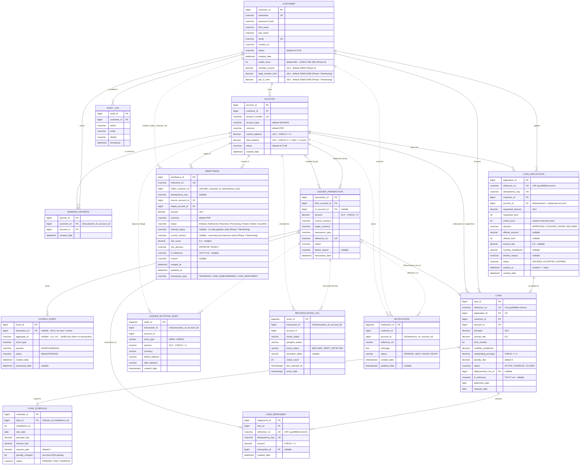

# PayPink 2.0 — Entity Relationship Diagram

Generated from the current code:

- **Azure SQL (OLTP):** `backend/ledger-core/src/main/resources/schema-azuresql.sql` (+ `scripts/migrate_phase5_hardening.sql`, `scripts/migrate_phase6_loans.sql`, `BankingFavoritesSchema.java`)
- **PostgreSQL (audit):** `backend/event-consumers/src/main/resources/schema-postgres.sql`, `backend/notification-service/src/main/resources/schema-postgres.sql`

Solid lines are enforced foreign keys. Dotted lines are logical references with no FK constraint. These include every Azure SQL → PostgreSQL link, because the two databases are separate and kept in sync through Kafka events.

## Notes and drift found in the code

- **`REMITTANCE.caller_customer_id` has no FK** to `CUSTOMER`. Ownership is checked in application code instead.
- **`LEDGER_MUTATION_AUDIT` column mismatch:** the SQL schema defines `entry_type` (DEBIT/CREDIT). The `microservices/audit-service` and `microservices/reconciliation-service` entities map a column named `operation`, which the DDL doesn't define. `ddl-auto` is `none`, so Hibernate won't fix this.
- ~~`NOTIFICATION` entity is partial~~ — fixed in Phase 6: the entity now maps `account_id`, `reference_no` and `updated_date`.
- **Phase 6 Loans:** the bank's loan pool is the `INTERNAL` account `PH1000000LOAN` owned by the system customer `paypink_bank`. Loan money only moves through transaction-service (REMITTANCE → LEDGER_TRANSACTION); loan-service never updates `ACCOUNT`.
- `REMITTANCE` exists in the Azure SQL schema only. `schema-oracle.sql` is the legacy Capstone 1 schema.
- Collapsed redundant indexes are not shown. For example, `idx_account_num` duplicates the `account_number` unique constraint.
